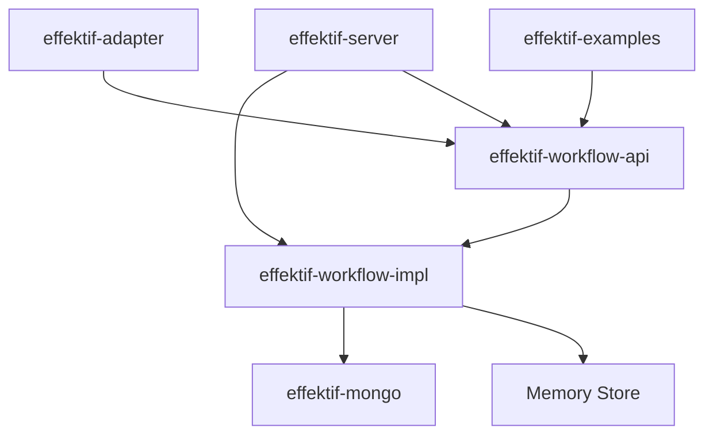

# Effektif 工作流引擎源码深度分析

## 目录
- [1. 项目概述](#1-项目概述)
- [2. 架构设计分析](#2-架构设计分析)
- [3. 核心类详解](#3-核心类详解)
- [4. 设计模式应用](#4-设计模式应用)
- [5. 并发控制机制](#5-并发控制机制)
- [6. 存储层设计](#6-存储层设计)
- [7. 扩展性分析](#7-扩展性分析)
- [8. 性能优化建议](#8-性能优化建议)

## 1. 项目概述

### 1.1 技术栈
- **编程语言**: Java 8
- **构建工具**: Maven
- **数据库**: MongoDB (可选)
- **Web框架**: Jersey (JAX-RS)
- **服务器**: Jetty
- **日志**: SLF4J + Logback
- **时间处理**: Joda Time

### 1.2 模块结构
```
effektif/
├── effektif-workflow-api/      # API层：接口定义和数据模型
├── effektif-workflow-impl/     # 实现层：核心业务逻辑
├── effektif-mongo/            # 存储层：MongoDB持久化
├── effektif-server/           # 服务层：REST API
├── effektif-adapter/          # 扩展层：适配器框架
├── effektif-adapter-activity/ # 扩展层：活动适配器
├── effektif-email/           # 扩展层：邮件服务
├── effektif-script/          # 扩展层：脚本执行
└── effektif-examples/        # 示例和教程
```

## 2. 架构设计分析

### 2.1 分层架构
Effektif 采用经典的分层架构模式：

1. **表示层** (Presentation Layer)
   - REST API 接口
   - JSON 序列化/反序列化
   - HTTP 请求处理

2. **业务逻辑层** (Business Logic Layer)
   - 工作流引擎核心逻辑
   - 活动执行引擎
   - 流转控制逻辑

3. **数据访问层** (Data Access Layer)
   - 存储抽象接口
   - MongoDB/内存实现
   - 缓存管理

4. **基础设施层** (Infrastructure Layer)
   - 依赖注入容器
   - 配置管理
   - 日志和监控

### 2.2 模块间依赖关系



## 3. 核心类详解

### 3.1 WorkflowEngine 接口
```java
public interface WorkflowEngine {
    // 工作流部署
    Deployment deployWorkflow(ExecutableWorkflow workflow);
    
    // 工作流实例管理
    WorkflowInstance start(TriggerInstance triggerInstance);
    WorkflowInstance send(Message message);
    WorkflowInstance cancel(WorkflowInstanceId workflowInstanceId);
    
    // 变量管理
    VariableValues getVariableValues(WorkflowInstanceId workflowInstanceId);
    void setVariableValues(WorkflowInstanceId workflowInstanceId, VariableValues variableValues);
    
    // 查询和删除
    List<ExecutableWorkflow> findWorkflows(WorkflowQuery workflowQuery);
    List<WorkflowInstance> findWorkflowInstances(WorkflowInstanceQuery query);
}
```

**设计特点**:
- 采用门面模式，提供统一的访问接口
- 方法职责单一，符合单一职责原则
- 支持同步和异步操作

### 3.2 ExecutableWorkflow 类
```java
public class ExecutableWorkflow extends AbstractWorkflow {
    protected String sourceWorkflowId;    // 源工作流ID，用于版本控制
    protected LocalDateTime createTime;   // 创建时间
    protected String creatorId;          // 创建者ID
    
    // 建造者模式方法
    public ExecutableWorkflow activity(String id, Activity activity);
    public ExecutableWorkflow transition(Transition transition);
    public ExecutableWorkflow variable(Variable variable);
}
```

**设计特点**:
- 继承自 AbstractWorkflow → Scope → Element
- 采用建造者模式，支持链式调用
- 支持多种序列化格式 (JSON, BPMN XML)

### 3.3 WorkflowEngineImpl 实现类
```java
public class WorkflowEngineImpl implements WorkflowEngine, Brewable {
    // 核心组件
    public ExecutorService executorService;        // 异步执行服务
    public WorkflowCache workflowCache;            // 工作流缓存
    public WorkflowStore workflowStore;            // 工作流存储
    public WorkflowInstanceStore workflowInstanceStore; // 实例存储
    public DataTypeService dataTypeService;        // 数据类型服务
    
    // 核心方法实现
    public Deployment deployWorkflow(ExecutableWorkflow workflow) {
        // 1. 解析和验证
        WorkflowParser parser = new WorkflowParser(configuration);
        parser.parse(workflow);
        
        // 2. 存储和缓存
        if (!parser.hasErrors()) {
            workflowStore.insertWorkflow(workflow);
            workflowCache.put(workflowImpl);
        }
        
        return new Deployment(workflow.getId(), parser.getIssues());
    }
}
```

## 4. 设计模式应用

### 4.1 门面模式 (Facade Pattern)
- **位置**: WorkflowEngine 接口
- **作用**: 为复杂的工作流子系统提供简化接口
- **优势**: 隐藏内部复杂性，提供统一访问点

### 4.2 建造者模式 (Builder Pattern)
- **位置**: ExecutableWorkflow 类
- **作用**: 构建复杂的工作流定义对象
- **优势**: 支持链式调用，提高代码可读性

### 4.3 策略模式 (Strategy Pattern)
- **位置**: 存储层实现
- **作用**: 支持不同的存储策略 (内存 vs MongoDB)
- **优势**: 易于扩展新的存储实现

### 4.4 依赖注入模式
- **位置**: Brewery 容器
- **作用**: 管理组件依赖关系
- **优势**: 降低耦合度，提高可测试性

### 4.5 观察者模式 (Observer Pattern)
- **位置**: WorkflowExecutionListener
- **作用**: 监控工作流执行过程
- **优势**: 支持审计和监控功能

## 5. 并发控制机制

### 5.1 工作流实例锁
```java
// MongoDB 实现的原子锁操作
public WorkflowInstanceImpl lockWorkflowInstance(WorkflowInstanceId workflowInstanceId) {
    DBObject query = createLockQuery();
    query.put(_ID, new ObjectId(workflowInstanceId.getInternal()));
    
    DBObject update = createLockUpdate();
    
    // 使用 findAndModify 确保原子性
    BasicDBObject dbWorkflowInstance = workflowInstancesCollection
        .findAndModify("lock-workflow-instance", query, update, retrieveFields);
    
    return readWorkflowInstanceImpl(dbWorkflowInstance);
}
```

### 5.2 重试机制
```java
public WorkflowInstanceImpl lockWorkflowInstanceWithRetry(WorkflowInstanceId workflowInstanceId) {
    return Retry.retry(configuration, () -> {
        return lockWorkflowInstance(workflowInstanceId);
    });
}
```

### 5.3 异步执行
```java
public void executeAsync(Runnable asyncWork) {
    executorService.execute(asyncWork);
}
```

## 6. 存储层设计

### 6.1 存储抽象
```java
public interface WorkflowStore {
    WorkflowId generateWorkflowId();
    void insertWorkflow(ExecutableWorkflow workflow);
    List<ExecutableWorkflow> findWorkflows(WorkflowQuery query);
    ExecutableWorkflow loadWorkflowById(WorkflowId workflowId);
}

public interface WorkflowInstanceStore {
    WorkflowInstanceId generateWorkflowInstanceId();
    void insertWorkflowInstance(WorkflowInstanceImpl workflowInstance);
    WorkflowInstanceImpl lockWorkflowInstance(WorkflowInstanceId workflowInstanceId);
    void flush(WorkflowInstanceImpl workflowInstance);
}
```

### 6.2 MongoDB 实现特点
- 使用 ObjectId 作为主键
- 支持原子操作和乐观锁
- 文档结构灵活，支持嵌套对象
- 索引优化查询性能

### 6.3 内存实现特点
- 基于 ConcurrentHashMap
- 适用于测试和开发环境
- 无持久化，重启后数据丢失

## 7. 扩展性分析

### 7.1 活动类型扩展
```java
// 自定义活动类型
public class CustomActivity extends Activity {
    // 活动特定属性
}

// 对应的活动类型实现
public class CustomActivityType extends AbstractActivityType<CustomActivity> {
    @Override
    public void execute(ActivityInstanceImpl activityInstance) {
        // 自定义执行逻辑
    }
}
```

### 7.2 适配器机制
- 支持外部系统集成
- 动态活动类型注册
- REST API 调用适配器

### 7.3 数据类型扩展
```java
public class CustomDataType extends AbstractDataType {
    @Override
    public Object convertJsonToInternalValue(Object jsonValue) {
        // 自定义转换逻辑
    }
}
```

## 8. 性能优化建议

### 8.1 缓存优化
- 工作流定义缓存 (已实现)
- 活动类型缓存
- 查询结果缓存

### 8.2 数据库优化
- 合理的索引设计
- 分片策略
- 连接池配置

### 8.3 并发优化
- 减少锁的粒度
- 异步处理非关键路径
- 批量操作优化

### 8.4 监控和诊断
- JMX 监控指标
- 性能分析工具
- 日志结构化
