# Effektif 工作流引擎 UML 图表

本文档包含 Effektif 工作流引擎的各种 UML 图表，帮助理解系统架构和执行流程。

## 1. 系统架构图

### 1.1 模块依赖关系图

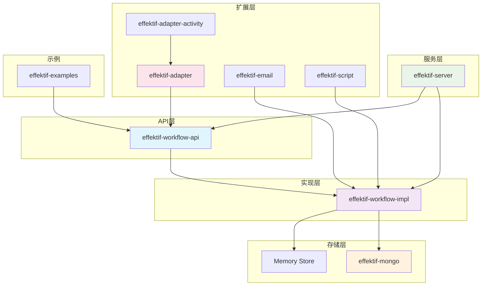
```mermaid
graph TB
    subgraph "API层"
        API[effektif-workflow-api]
    end
    
    subgraph "实现层"
        IMPL[effektif-workflow-impl]
    end
    
    subgraph "存储层"
        MONGO[effektif-mongo]
        MEMORY[Memory Store]
    end
    
    subgraph "服务层"
        SERVER[effektif-server]
    end
    
    subgraph "扩展层"
        ADAPTER[effektif-adapter]
        ADAPTER_ACT[effektif-adapter-activity]
        EMAIL[effektif-email]
        SCRIPT[effektif-script]
    end
    
    subgraph "示例"
        EXAMPLES[effektif-examples]
    end
    
    API --> IMPL
    IMPL --> MONGO
    IMPL --> MEMORY
    SERVER --> IMPL
    SERVER --> API
    ADAPTER --> API
    ADAPTER_ACT --> ADAPTER
    EMAIL --> IMPL
    SCRIPT --> IMPL
    EXAMPLES --> API
    
    style API fill:#e1f5fe
    style IMPL fill:#f3e5f5
    style MONGO fill:#fff3e0
    style SERVER fill:#e8f5e8
    style ADAPTER fill:#fce4ec
```

### 1.2 核心组件关系图

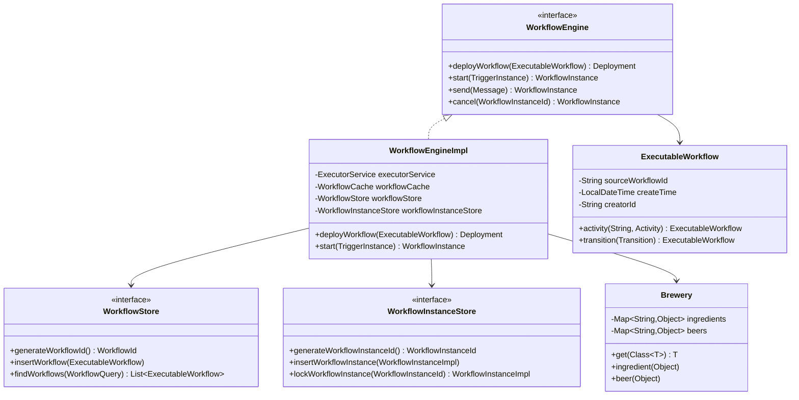
```mermaid
classDiagram
    class WorkflowEngine {
        <<interface>>
        +deployWorkflow(ExecutableWorkflow) Deployment
        +start(TriggerInstance) WorkflowInstance
        +send(Message) WorkflowInstance
        +cancel(WorkflowInstanceId) WorkflowInstance
    }
    
    class WorkflowEngineImpl {
        -ExecutorService executorService
        -WorkflowCache workflowCache
        -WorkflowStore workflowStore
        -WorkflowInstanceStore workflowInstanceStore
        +deployWorkflow(ExecutableWorkflow) Deployment
        +start(TriggerInstance) WorkflowInstance
    }
    
    class ExecutableWorkflow {
        -String sourceWorkflowId
        -LocalDateTime createTime
        -String creatorId
        +activity(String, Activity) ExecutableWorkflow
        +transition(Transition) ExecutableWorkflow
    }
    
    class WorkflowStore {
        <<interface>>
        +generateWorkflowId() WorkflowId
        +insertWorkflow(ExecutableWorkflow)
        +findWorkflows(WorkflowQuery) List~ExecutableWorkflow~
    }
    
    class WorkflowInstanceStore {
        <<interface>>
        +generateWorkflowInstanceId() WorkflowInstanceId
        +insertWorkflowInstance(WorkflowInstanceImpl)
        +lockWorkflowInstance(WorkflowInstanceId) WorkflowInstanceImpl
    }
    
    class Brewery {
        -Map~String,Object~ ingredients
        -Map~String,Object~ beers
        +get(Class~T~) T
        +ingredient(Object)
        +beer(Object)
    }
    
    WorkflowEngine <|.. WorkflowEngineImpl
    WorkflowEngineImpl --> WorkflowStore
    WorkflowEngineImpl --> WorkflowInstanceStore
    WorkflowEngineImpl --> Brewery
    WorkflowEngine --> ExecutableWorkflow
```

## 2. 工作流执行时序图

### 2.1 工作流部署时序图

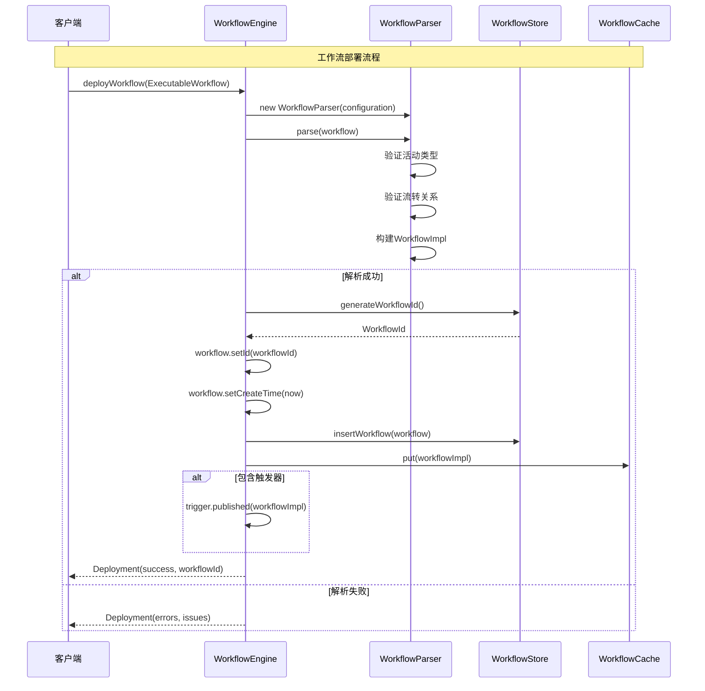
```mermaid
sequenceDiagram
    participant Client as 客户端
    participant Engine as WorkflowEngine
    participant Parser as WorkflowParser
    participant Store as WorkflowStore
    participant Cache as WorkflowCache
    
    Note over Client,Cache: 工作流部署流程
    
    Client->>Engine: deployWorkflow(ExecutableWorkflow)
    Engine->>Parser: new WorkflowParser(configuration)
    Engine->>Parser: parse(workflow)
    
    Parser->>Parser: 验证活动类型
    Parser->>Parser: 验证流转关系
    Parser->>Parser: 构建WorkflowImpl
    
    alt 解析成功
        Engine->>Store: generateWorkflowId()
        Store-->>Engine: WorkflowId
        Engine->>Engine: workflow.setId(workflowId)
        Engine->>Engine: workflow.setCreateTime(now)
        Engine->>Store: insertWorkflow(workflow)
        Engine->>Cache: put(workflowImpl)
        
        alt 包含触发器
            Engine->>Engine: trigger.published(workflowImpl)
        end
        
        Engine-->>Client: Deployment(success, workflowId)
    else 解析失败
        Engine-->>Client: Deployment(errors, issues)
    end
```

### 2.2 工作流实例启动时序图

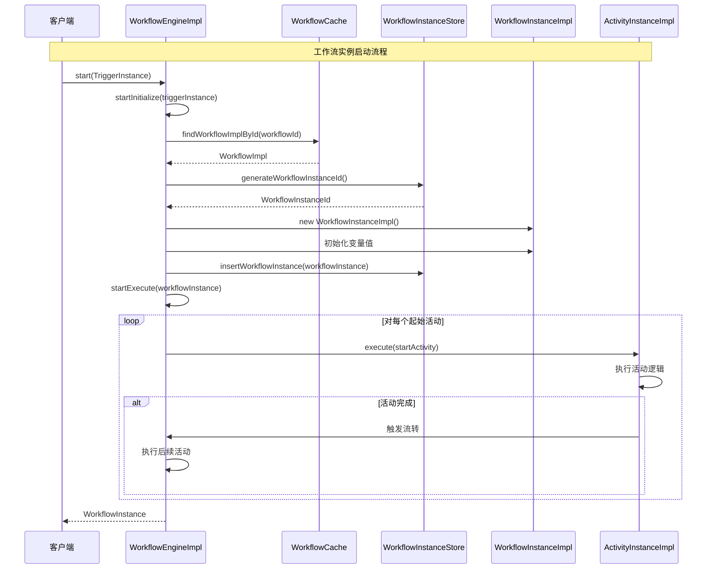
```mermaid
sequenceDiagram
    participant Client as 客户端
    participant Engine as WorkflowEngineImpl
    participant Cache as WorkflowCache
    participant Store as WorkflowInstanceStore
    participant Instance as WorkflowInstanceImpl
    participant Activity as ActivityInstanceImpl
    
    Note over Client,Activity: 工作流实例启动流程
    
    Client->>Engine: start(TriggerInstance)
    Engine->>Engine: startInitialize(triggerInstance)
    
    Engine->>Cache: findWorkflowImplById(workflowId)
    Cache-->>Engine: WorkflowImpl
    
    Engine->>Store: generateWorkflowInstanceId()
    Store-->>Engine: WorkflowInstanceId
    
    Engine->>Instance: new WorkflowInstanceImpl()
    Engine->>Instance: 初始化变量值
    Engine->>Store: insertWorkflowInstance(workflowInstance)
    
    Engine->>Engine: startExecute(workflowInstance)
    
    loop 对每个起始活动
        Engine->>Activity: execute(startActivity)
        Activity->>Activity: 执行活动逻辑
        
        alt 活动完成
            Activity->>Engine: 触发流转
            Engine->>Engine: 执行后续活动
        end
    end
    
    Engine-->>Client: WorkflowInstance
```

### 2.3 消息处理时序图

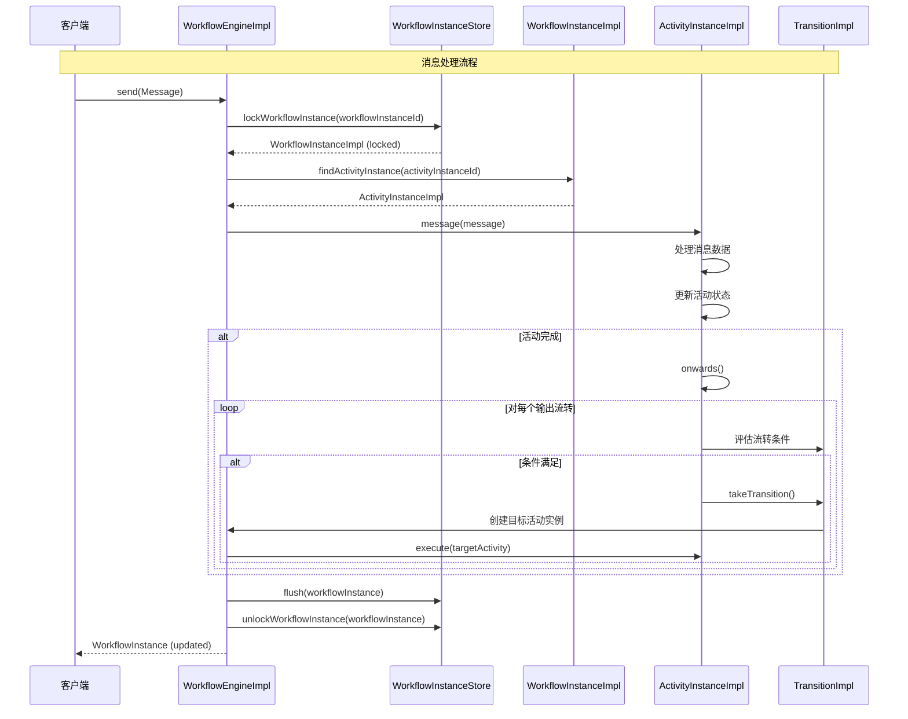
```mermaid
sequenceDiagram
    participant Client as 客户端
    participant Engine as WorkflowEngineImpl
    participant Store as WorkflowInstanceStore
    participant Instance as WorkflowInstanceImpl
    participant Activity as ActivityInstanceImpl
    participant Transition as TransitionImpl
    
    Note over Client,Transition: 消息处理流程
    
    Client->>Engine: send(Message)
    Engine->>Store: lockWorkflowInstance(workflowInstanceId)
    Store-->>Engine: WorkflowInstanceImpl (locked)
    
    Engine->>Instance: findActivityInstance(activityInstanceId)
    Instance-->>Engine: ActivityInstanceImpl
    
    Engine->>Activity: message(message)
    Activity->>Activity: 处理消息数据
    Activity->>Activity: 更新活动状态
    
    alt 活动完成
        Activity->>Activity: onwards()
        
        loop 对每个输出流转
            Activity->>Transition: 评估流转条件
            
            alt 条件满足
                Activity->>Transition: takeTransition()
                Transition->>Engine: 创建目标活动实例
                Engine->>Activity: execute(targetActivity)
            end
        end
    end
    
    Engine->>Store: flush(workflowInstance)
    Engine->>Store: unlockWorkflowInstance(workflowInstance)
    Engine-->>Client: WorkflowInstance (updated)
```

## 3. 活动类型系统图

### 3.1 活动类型继承图

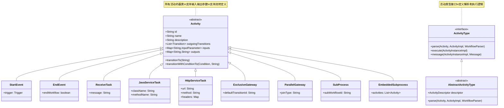
```mermaid
classDiagram
    class Activity {
        <<abstract>>
        +String id
        +String name
        +String description
        +List~Transition~ outgoingTransitions
        +Map~String,InputParameter~ inputs
        +Map~String,String~ outputs
        +transitionTo(String)
        +transitionWithConditionTo(Condition, String)
    }
    
    class StartEvent {
        +trigger: Trigger
    }
    
    class EndEvent {
        +endWorkflow: boolean
    }
    
    class ReceiveTask {
        +message: String
    }
    
    class JavaServiceTask {
        +className: String
        +methodName: String
    }
    
    class HttpServiceTask {
        +url: String
        +method: String
        +headers: Map
    }
    
    class ExclusiveGateway {
        +defaultTransitionId: String
    }
    
    class ParallelGateway {
        +joinType: String
    }
    
    class SubProcess {
        +subWorkflowId: String
    }
    
    class EmbeddedSubprocess {
        +activities: List~Activity~
    }
    
    Activity <|-- StartEvent
    Activity <|-- EndEvent
    Activity <|-- ReceiveTask
    Activity <|-- JavaServiceTask
    Activity <|-- HttpServiceTask
    Activity <|-- ExclusiveGateway
    Activity <|-- ParallelGateway
    Activity <|-- SubProcess
    Activity <|-- EmbeddedSubprocess
    
    class ActivityType {
        <<interface>>
        +parse(Activity, ActivityImpl, WorkflowParser)
        +execute(ActivityInstanceImpl)
        +message(ActivityInstanceImpl, Message)
    }
    
    class AbstractActivityType {
        <<abstract>>
        +ActivityDescriptor descriptor
        +parse(Activity, ActivityImpl, WorkflowParser)
    }
    
    ActivityType <|.. AbstractActivityType
    
    note for Activity "所有活动的基类\n支持输入输出参数\n支持流转定义"
    note for ActivityType "活动类型接口\n定义解析和执行逻辑"
```

### 3.2 活动执行状态图

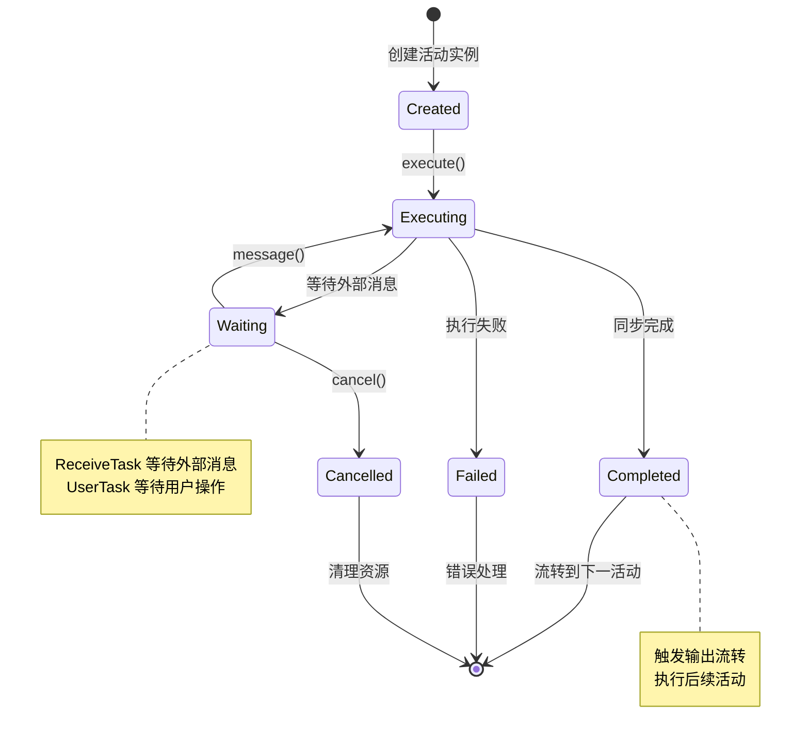
```mermaid
stateDiagram-v2
    [*] --> Created: 创建活动实例
    
    Created --> Executing: execute()
    
    Executing --> Waiting: 等待外部消息
    Executing --> Completed: 同步完成
    Executing --> Failed: 执行失败
    
    Waiting --> Executing: message()
    Waiting --> Cancelled: cancel()
    
    Completed --> [*]: 流转到下一活动
    Failed --> [*]: 错误处理
    Cancelled --> [*]: 清理资源
    
    note right of Waiting
        ReceiveTask 等待外部消息
        UserTask 等待用户操作
    end note
    
    note right of Completed
        触发输出流转
        执行后续活动
    end note
```

## 4. 存储层架构图

### 4.1 存储抽象层图

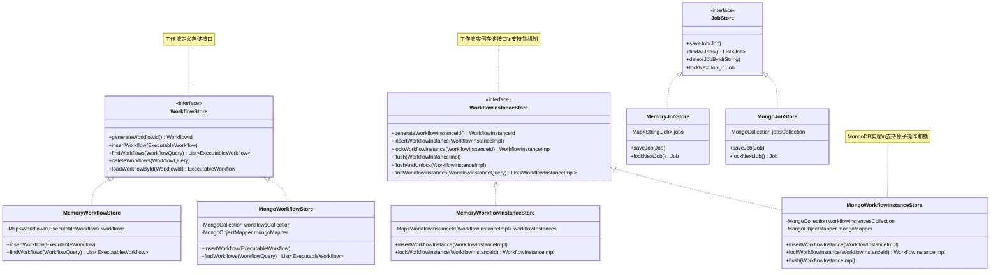
```mermaid
classDiagram
    class WorkflowStore {
        <<interface>>
        +generateWorkflowId() WorkflowId
        +insertWorkflow(ExecutableWorkflow)
        +findWorkflows(WorkflowQuery) List~ExecutableWorkflow~
        +deleteWorkflows(WorkflowQuery)
        +loadWorkflowById(WorkflowId) ExecutableWorkflow
    }
    
    class WorkflowInstanceStore {
        <<interface>>
        +generateWorkflowInstanceId() WorkflowInstanceId
        +insertWorkflowInstance(WorkflowInstanceImpl)
        +lockWorkflowInstance(WorkflowInstanceId) WorkflowInstanceImpl
        +flush(WorkflowInstanceImpl)
        +flushAndUnlock(WorkflowInstanceImpl)
        +findWorkflowInstances(WorkflowInstanceQuery) List~WorkflowInstanceImpl~
    }
    
    class JobStore {
        <<interface>>
        +saveJob(Job)
        +findAllJobs() List~Job~
        +deleteJobById(String)
        +lockNextJob() Job
    }
    
    class MemoryWorkflowStore {
        -Map~WorkflowId,ExecutableWorkflow~ workflows
        +insertWorkflow(ExecutableWorkflow)
        +findWorkflows(WorkflowQuery) List~ExecutableWorkflow~
    }
    
    class MemoryWorkflowInstanceStore {
        -Map~WorkflowInstanceId,WorkflowInstanceImpl~ workflowInstances
        +insertWorkflowInstance(WorkflowInstanceImpl)
        +lockWorkflowInstance(WorkflowInstanceId) WorkflowInstanceImpl
    }
    
    class MemoryJobStore {
        -Map~String,Job~ jobs
        +saveJob(Job)
        +lockNextJob() Job
    }
    
    class MongoWorkflowStore {
        -MongoCollection workflowsCollection
        -MongoObjectMapper mongoMapper
        +insertWorkflow(ExecutableWorkflow)
        +findWorkflows(WorkflowQuery) List~ExecutableWorkflow~
    }
    
    class MongoWorkflowInstanceStore {
        -MongoCollection workflowInstancesCollection
        -MongoObjectMapper mongoMapper
        +insertWorkflowInstance(WorkflowInstanceImpl)
        +lockWorkflowInstance(WorkflowInstanceId) WorkflowInstanceImpl
        +flush(WorkflowInstanceImpl)
    }
    
    class MongoJobStore {
        -MongoCollection jobsCollection
        +saveJob(Job)
        +lockNextJob() Job
    }
    
    WorkflowStore <|.. MemoryWorkflowStore
    WorkflowStore <|.. MongoWorkflowStore
    WorkflowInstanceStore <|.. MemoryWorkflowInstanceStore
    WorkflowInstanceStore <|.. MongoWorkflowInstanceStore
    JobStore <|.. MemoryJobStore
    JobStore <|.. MongoJobStore
    
    note for WorkflowStore "工作流定义存储接口"
    note for WorkflowInstanceStore "工作流实例存储接口\n支持锁机制"
    note for MongoWorkflowInstanceStore "MongoDB实现\n支持原子操作和锁"
```

## 5. 并发控制机制图

### 5.1 工作流实例锁机制

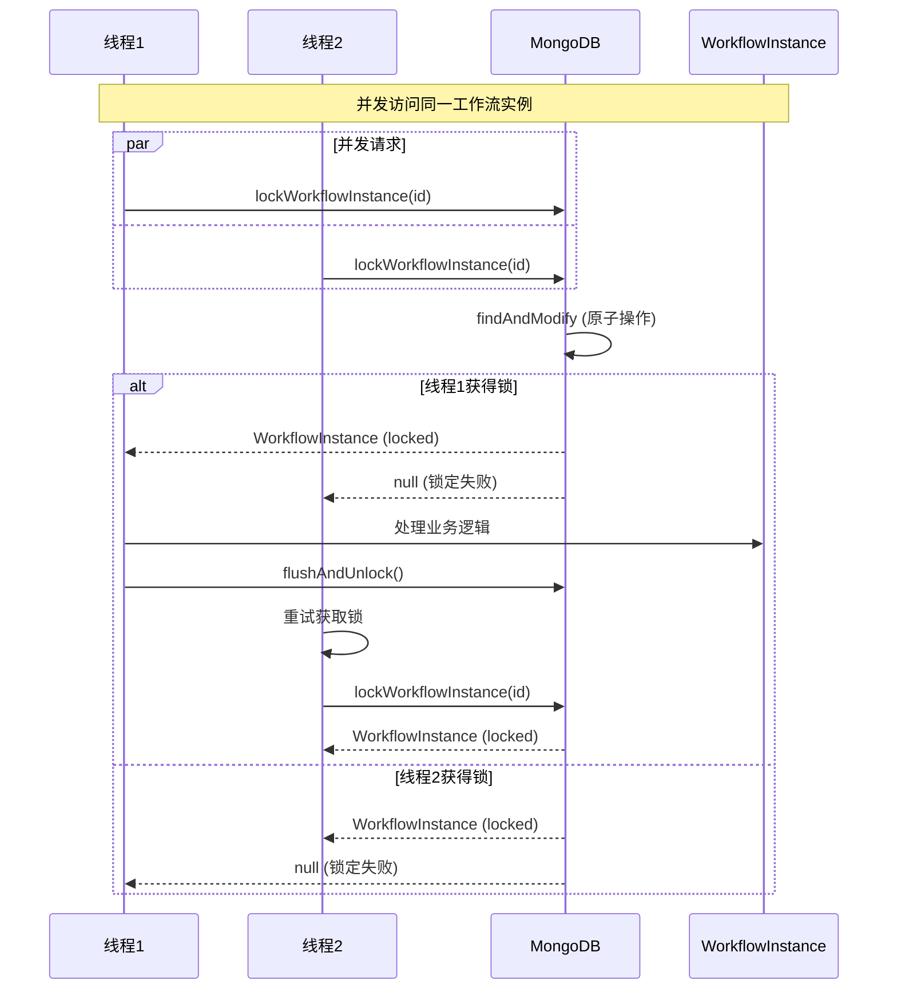
```mermaid
sequenceDiagram
    participant Thread1 as 线程1
    participant Thread2 as 线程2
    participant MongoDB as MongoDB
    participant Instance as WorkflowInstance

    Note over Thread1,Instance: 并发访问同一工作流实例

    par 并发请求
        Thread1->>MongoDB: lockWorkflowInstance(id)
        and
        Thread2->>MongoDB: lockWorkflowInstance(id)
    end

    MongoDB->>MongoDB: findAndModify (原子操作)

    alt 线程1获得锁
        MongoDB-->>Thread1: WorkflowInstance (locked)
        MongoDB-->>Thread2: null (锁定失败)

        Thread1->>Instance: 处理业务逻辑
        Thread1->>MongoDB: flushAndUnlock()

        Thread2->>Thread2: 重试获取锁
        Thread2->>MongoDB: lockWorkflowInstance(id)
        MongoDB-->>Thread2: WorkflowInstance (locked)
    else 线程2获得锁
        MongoDB-->>Thread2: WorkflowInstance (locked)
        MongoDB-->>Thread1: null (锁定失败)
    end
```

### 5.2 重试机制流程图

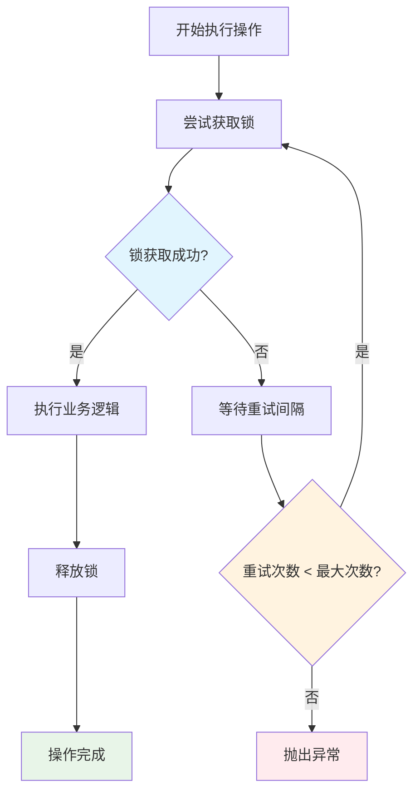
```mermaid
flowchart TD
    A[开始执行操作] --> B[尝试获取锁]
    B --> C{锁获取成功?}

    C -->|是| D[执行业务逻辑]
    C -->|否| E[等待重试间隔]

    E --> F{重试次数 < 最大次数?}
    F -->|是| B
    F -->|否| G[抛出异常]

    D --> H[释放锁]
    H --> I[操作完成]

    style C fill:#e1f5fe
    style F fill:#fff3e0
    style G fill:#ffebee
    style I fill:#e8f5e8
```

## 6. 依赖注入容器图

### 6.1 Brewery 容器架构图

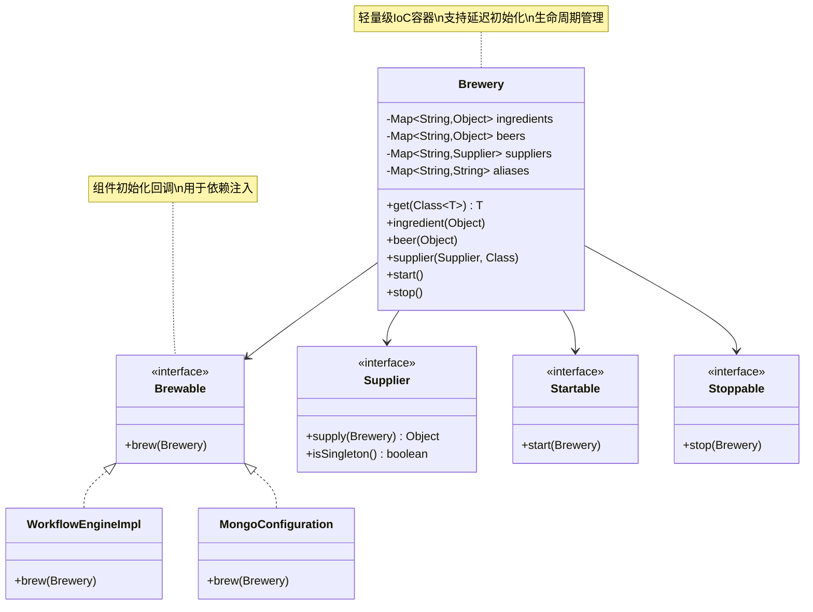
```mermaid
classDiagram
    class Brewery {
        -Map~String,Object~ ingredients
        -Map~String,Object~ beers
        -Map~String,Supplier~ suppliers
        -Map~String,String~ aliases
        +get(Class~T~) T
        +ingredient(Object)
        +beer(Object)
        +supplier(Supplier, Class)
        +start()
        +stop()
    }

    class Brewable {
        <<interface>>
        +brew(Brewery)
    }

    class Supplier {
        <<interface>>
        +supply(Brewery) Object
        +isSingleton() boolean
    }

    class Startable {
        <<interface>>
        +start(Brewery)
    }

    class Stoppable {
        <<interface>>
        +stop(Brewery)
    }

    class WorkflowEngineImpl {
        +brew(Brewery)
    }

    class MongoConfiguration {
        +brew(Brewery)
    }

    Brewery --> Brewable
    Brewery --> Supplier
    Brewery --> Startable
    Brewery --> Stoppable

    Brewable <|.. WorkflowEngineImpl
    Brewable <|.. MongoConfiguration

    note for Brewery "轻量级IoC容器\n支持延迟初始化\n生命周期管理"
    note for Brewable "组件初始化回调\n用于依赖注入"
```

### 6.2 组件初始化时序图

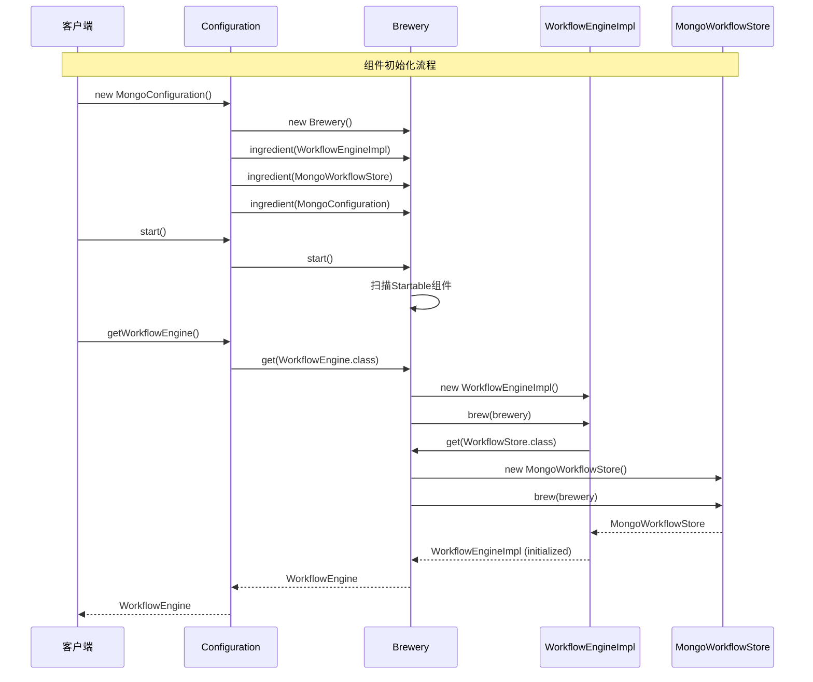
```mermaid
sequenceDiagram
    participant Client as 客户端
    participant Config as Configuration
    participant Brewery as Brewery
    participant Engine as WorkflowEngineImpl
    participant Store as MongoWorkflowStore

    Note over Client,Store: 组件初始化流程

    Client->>Config: new MongoConfiguration()
    Config->>Brewery: new Brewery()
    Config->>Brewery: ingredient(WorkflowEngineImpl)
    Config->>Brewery: ingredient(MongoWorkflowStore)
    Config->>Brewery: ingredient(MongoConfiguration)

    Client->>Config: start()
    Config->>Brewery: start()

    Brewery->>Brewery: 扫描Startable组件

    Client->>Config: getWorkflowEngine()
    Config->>Brewery: get(WorkflowEngine.class)

    Brewery->>Engine: new WorkflowEngineImpl()
    Brewery->>Engine: brew(brewery)

    Engine->>Brewery: get(WorkflowStore.class)
    Brewery->>Store: new MongoWorkflowStore()
    Brewery->>Store: brew(brewery)

    Store-->>Engine: MongoWorkflowStore
    Engine-->>Brewery: WorkflowEngineImpl (initialized)
    Brewery-->>Config: WorkflowEngine
    Config-->>Client: WorkflowEngine
```

## 7. 工作流模式图

### 7.1 顺序执行模式

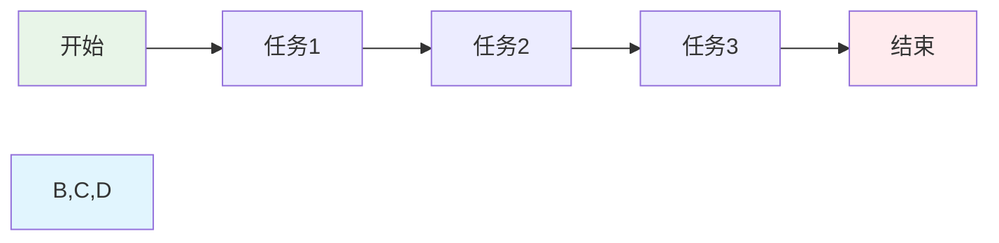
```mermaid
flowchart LR
    A[开始] --> B[任务1]
    B --> C[任务2]
    C --> D[任务3]
    D --> E[结束]

    style A fill:#e8f5e8
    style E fill:#ffebee
    style B,C,D fill:#e1f5fe
```

### 7.2 并行执行模式

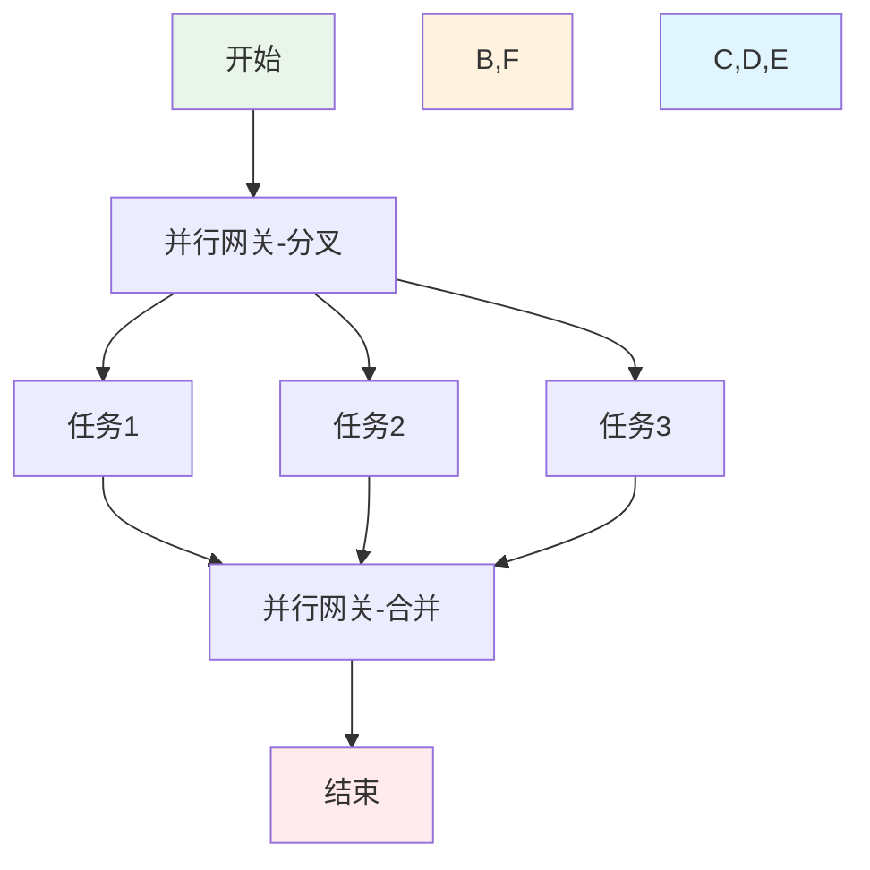
```mermaid
flowchart TD
    A[开始] --> B[并行网关-分叉]

    B --> C[任务1]
    B --> D[任务2]
    B --> E[任务3]

    C --> F[并行网关-合并]
    D --> F
    E --> F

    F --> G[结束]

    style A fill:#e8f5e8
    style G fill:#ffebee
    style B,F fill:#fff3e0
    style C,D,E fill:#e1f5fe
```

### 7.3 条件分支模式

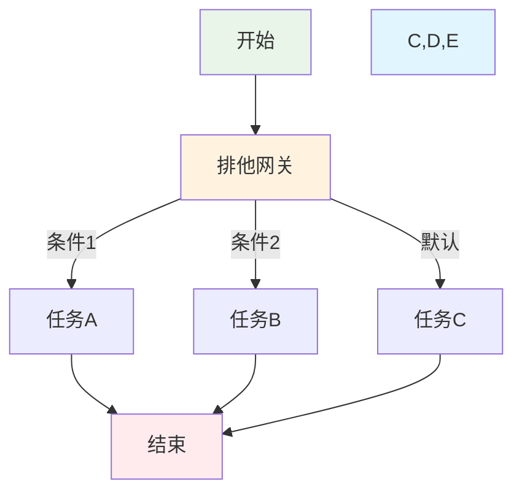
```mermaid
flowchart TD
    A[开始] --> B[排他网关]

    B -->|条件1| C[任务A]
    B -->|条件2| D[任务B]
    B -->|默认| E[任务C]

    C --> F[结束]
    D --> F
    E --> F

    style A fill:#e8f5e8
    style F fill:#ffebee
    style B fill:#fff3e0
    style C,D,E fill:#e1f5fe
```

### 7.4 循环执行模式

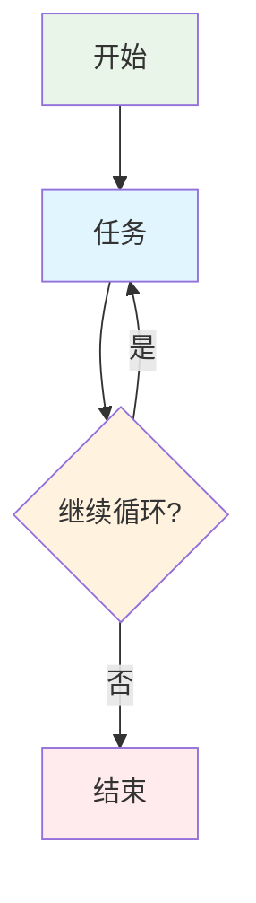
```mermaid
flowchart TD
    A[开始] --> B[任务]
    B --> C{继续循环?}

    C -->|是| B
    C -->|否| D[结束]

    style A fill:#e8f5e8
    style D fill:#ffebee
    style B fill:#e1f5fe
    style C fill:#fff3e0
```

## 8. 错误处理机制图

### 8.1 错误边界事件处理

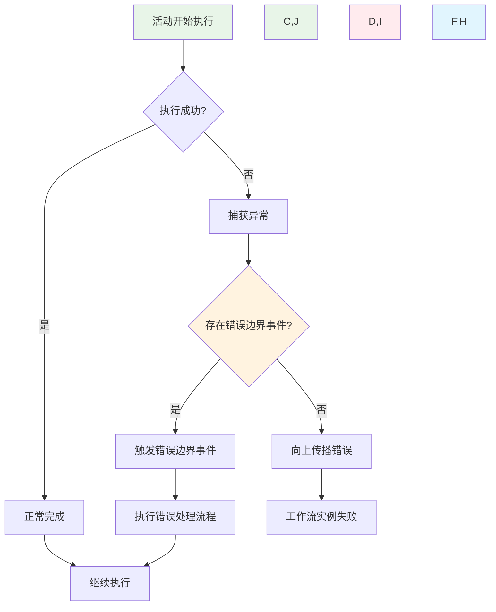
```mermaid
flowchart TD
    A[活动开始执行] --> B{执行成功?}

    B -->|是| C[正常完成]
    B -->|否| D[捕获异常]

    D --> E{存在错误边界事件?}

    E -->|是| F[触发错误边界事件]
    E -->|否| G[向上传播错误]

    F --> H[执行错误处理流程]
    G --> I[工作流实例失败]

    C --> J[继续执行]
    H --> J

    style A fill:#e8f5e8
    style C,J fill:#e8f5e8
    style D,I fill:#ffebee
    style E fill:#fff3e0
    style F,H fill:#e1f5fe
```

### 8.2 重试机制状态图

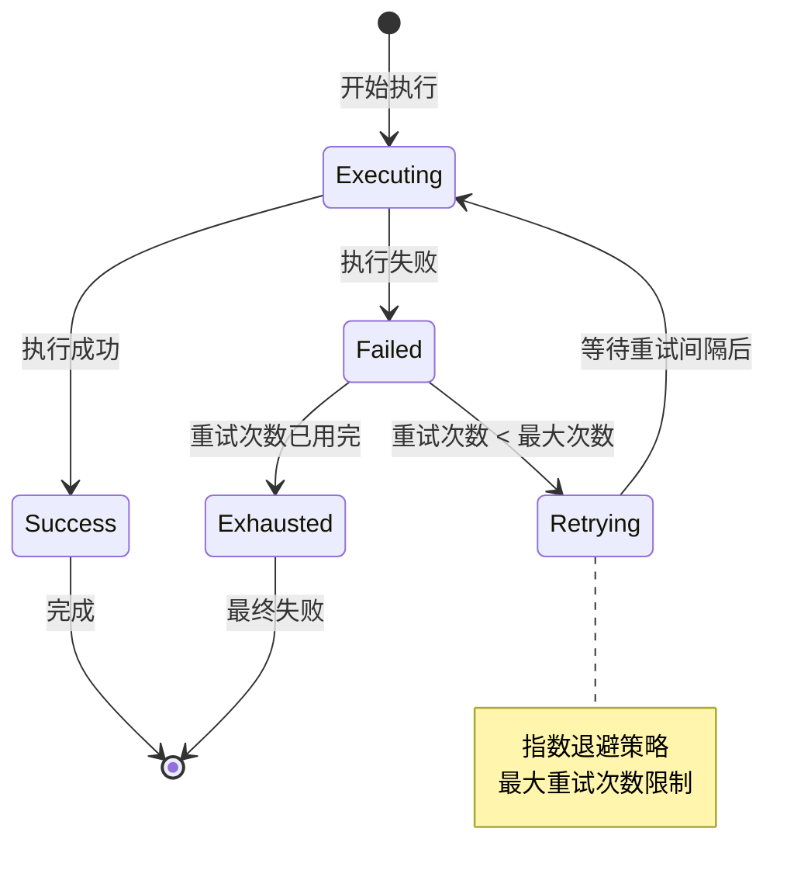
```mermaid
stateDiagram-v2
    [*] --> Executing: 开始执行

    Executing --> Success: 执行成功
    Executing --> Failed: 执行失败

    Failed --> Retrying: 重试次数 < 最大次数
    Failed --> Exhausted: 重试次数已用完

    Retrying --> Executing: 等待重试间隔后

    Success --> [*]: 完成
    Exhausted --> [*]: 最终失败

    note right of Retrying
        指数退避策略
        最大重试次数限制
    end note
```

---

**说明**: 这些图表展示了 Effektif 工作流引擎的核心架构和执行流程。通过这些可视化图表，可以更好地理解系统的设计思想和运行机制。
```
