# 集成平台新增Trigger技术方案设计文档

## 1. 子模块功能描述

### 1.1 概述
基于effektif工作流框架，设计并实现集成平台的触发器(Trigger)子系统，支持多种外部事件源触发工作流执行，实现企业级集成平台的核心功能。

### 1.2 功能模块

#### 1.2.1 HttpTrigger - HTTP触发器
- **功能**: 通过HTTP Webhook接收外部系统的事件通知
- **特性**: 
  - 支持GET/POST/PUT/DELETE等HTTP方法
  - 支持JSON/XML/Form等数据格式
  - 支持请求头验证和签名验证
  - 支持异步处理和响应
- **应用场景**: 第三方系统集成、API Gateway事件、支付回调等

#### 1.2.2 MessageQueueTrigger - 消息队列触发器
- **功能**: 监听消息队列(RabbitMQ/Kafka/ActiveMQ)中的消息
- **特性**:
  - 支持多种消息中间件
  - 支持消息确认机制
  - 支持死信队列处理
  - 支持批量消息处理
- **应用场景**: 异步消息处理、事件驱动架构、微服务间通信

#### 1.2.3 ScheduledTrigger - 定时触发器
- **功能**: 基于时间规则定时触发工作流
- **特性**:
  - 支持Cron表达式
  - 支持固定间隔和固定延迟
  - 支持时区处理
  - 支持任务持久化和集群部署
- **应用场景**: 定时数据同步、报表生成、系统维护任务

#### 1.2.4 DatabaseTrigger - 数据库触发器
- **功能**: 监听数据库表的增删改操作
- **特性**:
  - 支持MySQL/PostgreSQL/Oracle等主流数据库
  - 支持CDC(Change Data Capture)技术
  - 支持表级和行级过滤
  - 支持事务一致性
- **应用场景**: 数据同步、审计日志、实时数据处理

#### 1.2.5 FileTrigger - 文件触发器
- **功能**: 监听文件系统的文件变更事件
- **特性**:
  - 支持文件创建、修改、删除事件
  - 支持目录递归监听
  - 支持文件过滤规则
  - 支持FTP/SFTP远程文件监听
- **应用场景**: 文件处理、数据导入、日志分析

## 2. 时序图和架构图

### 2.1 整体架构图

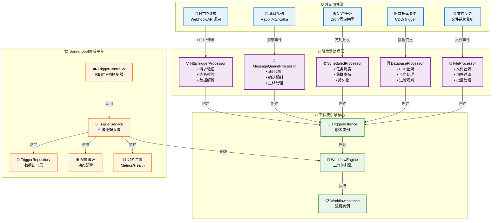

### 2.2 HTTP触发器时序图

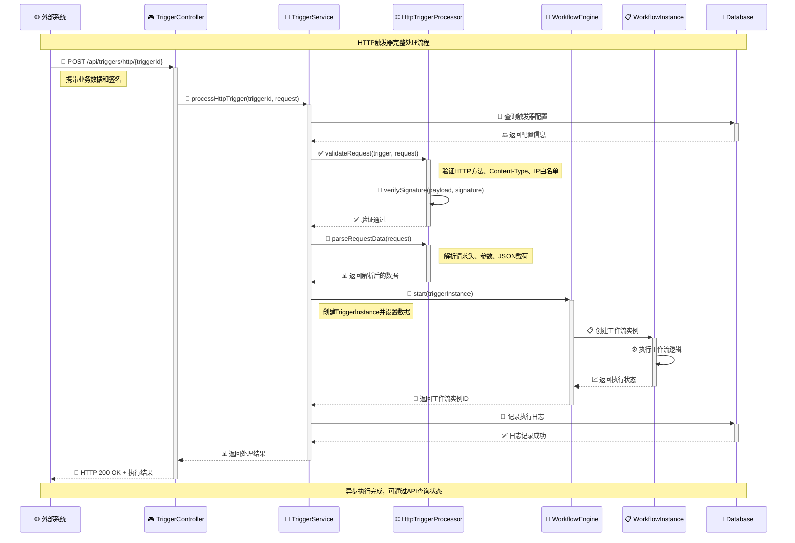

### 2.3 消息队列触发器时序图

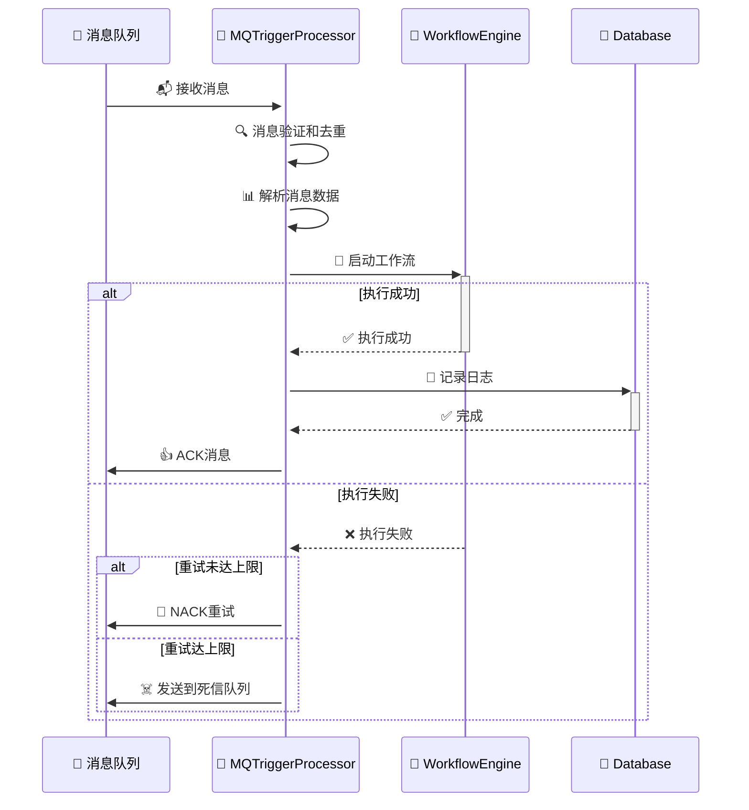

## 3. 集成平台2.0动态编排Trigger节点设计

### 3.1 概述

基于集成平台2.0的动态编排需求，参考Zapier和n8n的设计理念，设计一套完整的Trigger节点系统。该系统支持数据拉取策略、数组传递、上下文传递等核心功能，实现类似Zapier的自动化工作流编排能力。

### 3.2 核心设计理念

#### 3.2.1 参考Zapier设计模式
- **Trigger + Action模式**: 一个集成流 = 一个Trigger + 一个或多个Action
- **数据自动拆分**: Trigger接收到批量数据时自动拆解为单条数据
- **上下文传递**: 每个节点的输出作为下个节点的输入
- **轮询分页支持**: 支持API分页拉取大量数据

#### 3.2.2 参考n8n设计模式
- **节点化编程**: 每个节点都是独立的处理单元
- **数据流管道**: 数据在节点间流转，支持复杂的数据转换
- **表达式引擎**: 支持JavaScript表达式进行数据映射和转换
- **错误处理**: 完善的错误处理和重试机制

### 3.3 Trigger节点架构设计

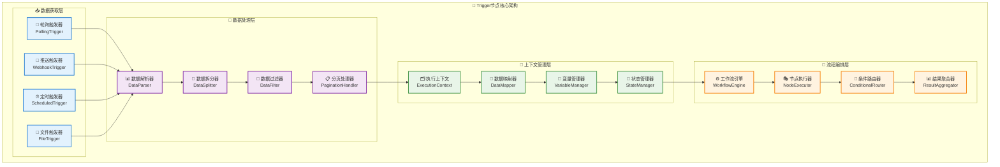

### 3.4 数据拉取策略设计

#### 3.4.1 轮询策略（Polling Strategy）

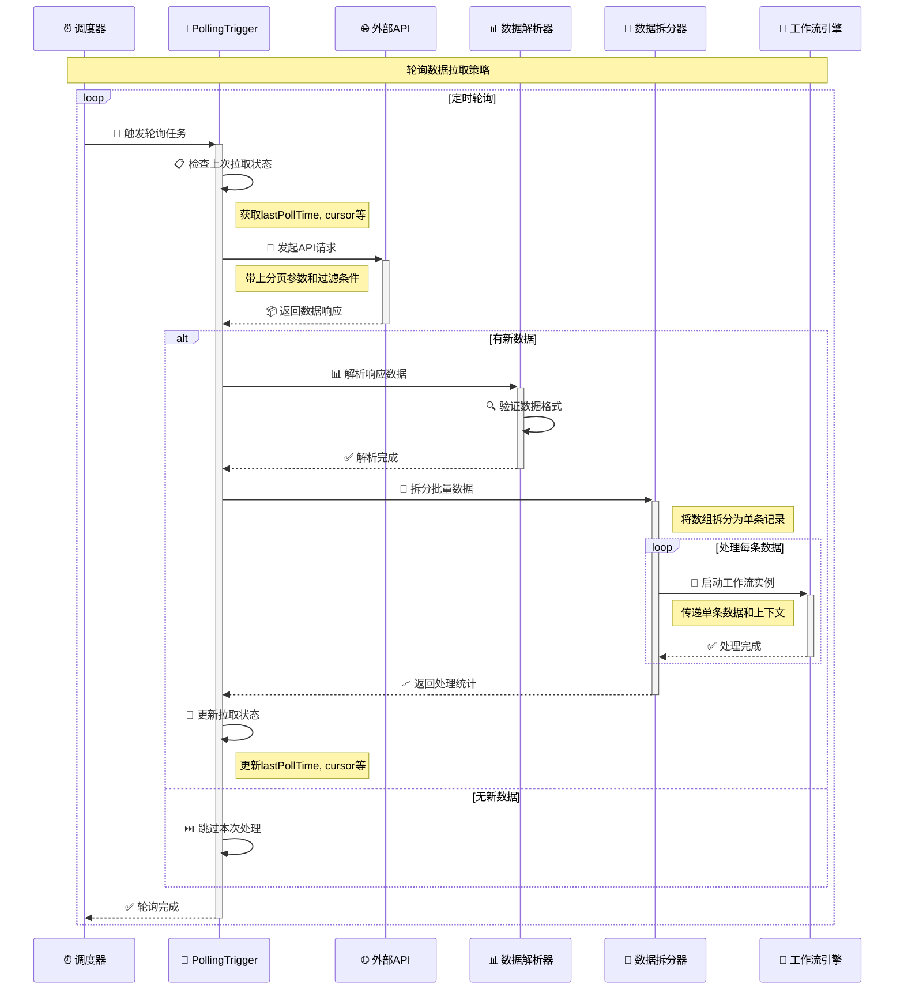

#### 3.4.2 分页拉取策略

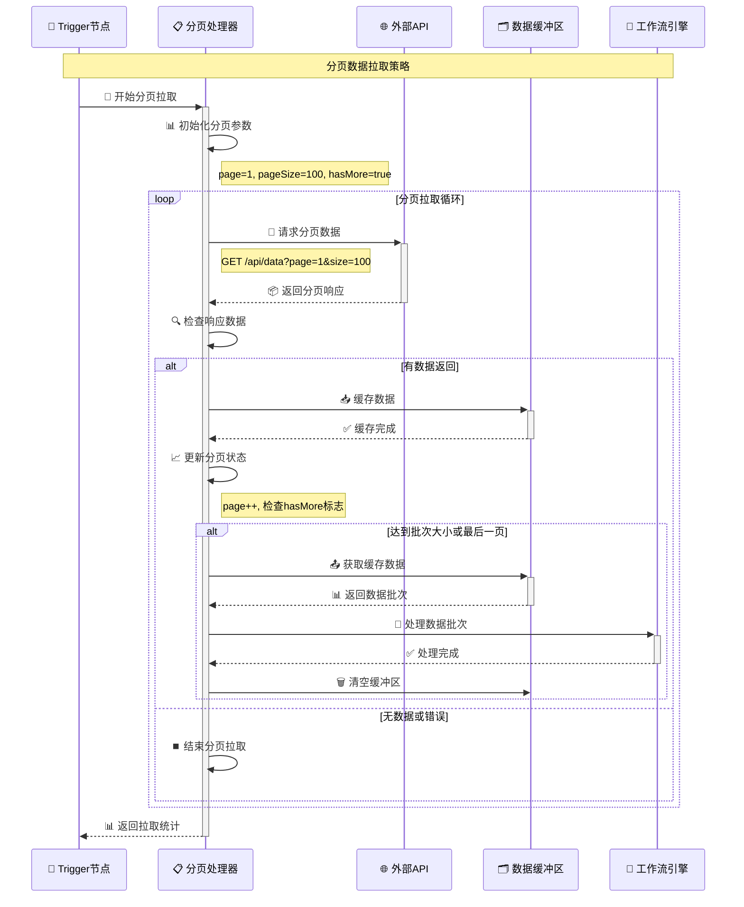

### 3.5 数据数组传递策略

#### 3.5.1 数据拆分策略对比

基于集成平台2.0文档，参考Zapier的设计，支持两种数据传递策略：

**策略1：顺序执行模式**
- 集成流顺序执行，第一个节点就是trigger节点
- 从trigger节点顺序往下执行
- 适合简单的线性处理流程

**策略2：数据驱动模式（推荐）**
- trigger节点挑出来，拿到数据后，再启动集成流
- 执行其它节点，实现数据驱动的工作流
- 对用户配置相对友好，隐藏复杂的语义

```mermaid
graph TB
    subgraph "策略1：顺序执行模式"
        A1[🎯 Trigger节点] --> A2[⚙️ Action节点1]
        A2 --> A3[⚙️ Action节点2]
        A3 --> A4[⚙️ Action节点3]

        A5[📊 数据: [item1, item2, item3]]
        A5 --> A1

        Note1[❌ 问题：批量数据处理复杂<br/>❌ 错误处理困难<br/>❌ 部分失败难以处理]
    end

    subgraph "策略2：数据驱动模式（推荐）"
        B1[🎯 Trigger节点<br/>数据拆分器]
        B2[📊 数据: [item1, item2, item3]]
        B2 --> B1

        B1 --> B3[🚀 工作流实例1<br/>item1]
        B1 --> B4[🚀 工作流实例2<br/>item2]
        B1 --> B5[🚀 工作流实例3<br/>item3]

        B3 --> B6[⚙️ Action节点1]
        B4 --> B7[⚙️ Action节点1]
        B5 --> B8[⚙️ Action节点1]

        Note2[✅ 优势：独立处理每条数据<br/>✅ 错误隔离<br/>✅ 并行处理能力]
    end

    classDef strategy1 fill:#ffebee,stroke:#c62828,stroke-width:2px
    classDef strategy2 fill:#e8f5e8,stroke:#2e7d32,stroke-width:2px
    classDef problem fill:#fff3e0,stroke:#ef6c00,stroke-width:1px
    classDef advantage fill:#e3f2fd,stroke:#1565c0,stroke-width:1px

    class A1,A2,A3,A4,A5 strategy1
    class B1,B2,B3,B4,B5,B6,B7,B8 strategy2
    class Note1 problem
    class Note2 advantage
```

#### 3.5.2 数据拆分处理时序图

```mermaid
sequenceDiagram
    participant Trigger as 🎯 Trigger节点
    participant Splitter as 🔀 数据拆分器
    participant Context as 🗂️ 执行上下文
    participant Engine as 🚀 工作流引擎
    participant Monitor as 📊 监控系统

    Note over Trigger,Monitor: 数据数组拆分处理流程

    Trigger->>+Splitter: 📦 传入批量数据
    Note right of Trigger: 数据格式：[{id:1,name:"A"},{id:2,name:"B"}]

    Splitter->>Splitter: 🔍 验证数据格式
    Note right of Splitter: 确保是JSON数组格式

    alt 数据格式正确
        loop 遍历数组元素
            Splitter->>+Context: 🗂️ 创建执行上下文
            Note right of Splitter: 为每条数据创建独立上下文

            Context->>Context: 📝 设置上下文变量
            Note right of Context: 设置item数据、索引、总数等

            Context-->>-Splitter: ✅ 上下文创建完成

            Splitter->>+Engine: 🚀 启动工作流实例
            Note right of Splitter: 传递单条数据和上下文

            par 并行处理
                Engine->>Engine: ⚙️ 执行Action节点
                Engine->>+Monitor: 📈 上报执行指标
                Monitor-->>-Engine: ✅ 指标记录完成
            end

            alt 处理成功
                Engine-->>Splitter: ✅ 实例执行成功
                Splitter->>Splitter: 📊 记录成功统计
            else 处理失败
                Engine-->>Splitter: ❌ 实例执行失败
                Splitter->>Splitter: 📊 记录失败统计

                alt 启用错误隔离
                    Splitter->>Splitter: ⏭️ 继续处理下一条
                    Note right of Splitter: 错误不影响其他数据处理
                else 启用快速失败
                    Splitter->>Splitter: ⏹️ 停止后续处理
                end
            end
        end

        Splitter->>Splitter: 📊 汇总处理结果
        Splitter-->>-Trigger: 📈 返回处理统计

    else 数据格式错误
        Splitter-->>-Trigger: ❌ 数据格式验证失败
    end
```

### 3.6 上下文传递机制设计

#### 3.6.1 执行上下文结构

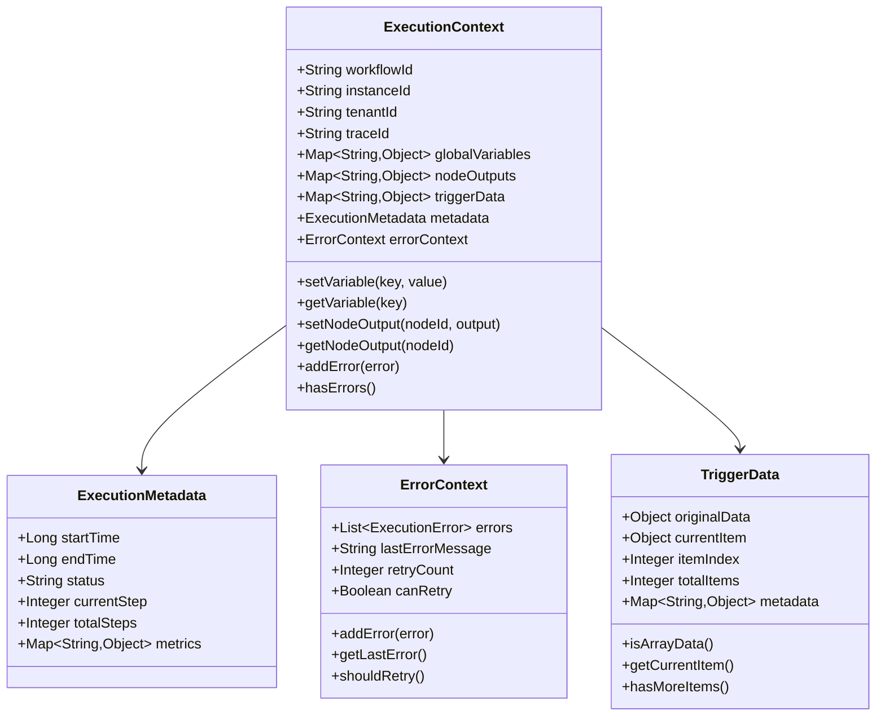

#### 3.6.2 上下文传递时序图

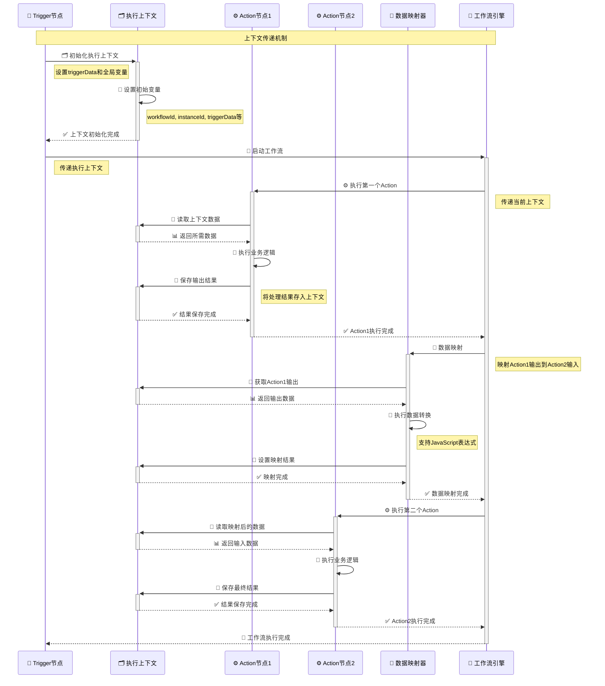

### 3.7 Trigger节点技术实现

#### 3.7.1 核心接口设计

<augment_code_snippet path="src/main/java/com/effektif/workflow/api/trigger/TriggerNode.java" mode="EXCERPT">
```java
/**
 * Trigger节点核心接口
 * 参考Zapier和n8n设计理念
 */
public interface TriggerNode {

    /**
     * 数据拉取策略枚举
     */
    enum PullStrategy {
        POLLING,    // 轮询拉取
        WEBHOOK,    // Webhook推送
        SCHEDULED,  // 定时触发
        FILE_WATCH  // 文件监听
    }

    /**
     * 数据处理策略枚举
     */
    enum DataStrategy {
        SEQUENTIAL,  // 顺序处理（策略1）
        SPLIT_ARRAY  // 数组拆分（策略2，推荐）
    }

    /**
     * 初始化Trigger节点
     */
    void initialize(TriggerConfig config);

    /**
     * 启动数据拉取
     */
    CompletableFuture<TriggerResult> startPulling();

    /**
     * 停止数据拉取
     */
    void stopPulling();

    /**
     * 处理拉取到的数据
     */
    List<WorkflowInstance> processData(Object data, ExecutionContext context);

    /**
     * 获取拉取状态
     */
    TriggerStatus getStatus();
}
```
</augment_code_snippet>

#### 3.7.2 轮询触发器实现

<augment_code_snippet path="src/main/java/com/effektif/workflow/impl/trigger/PollingTrigger.java" mode="EXCERPT">
```java
/**
 * 轮询触发器实现
 * 支持分页拉取和数据拆分
 */
@Component
public class PollingTrigger implements TriggerNode {

    @Autowired
    private RestTemplate restTemplate;

    @Autowired
    private DataSplitter dataSplitter;

    @Autowired
    private WorkflowEngine workflowEngine;

    private TriggerConfig config;
    private ScheduledExecutorService scheduler;
    private volatile boolean isRunning = false;

    @Override
    public void initialize(TriggerConfig config) {
        this.config = config;
        this.scheduler = Executors.newScheduledThreadPool(1);
    }

    @Override
    public CompletableFuture<TriggerResult> startPulling() {
        isRunning = true;

        return CompletableFuture.supplyAsync(() -> {
            scheduler.scheduleWithFixedDelay(
                this::pollData,
                0,
                config.getPollInterval(),
                TimeUnit.SECONDS
            );
            return TriggerResult.success("Polling started");
        });
    }

    private void pollData() {
        try {
            // 1. 构建请求参数
            Map<String, Object> params = buildRequestParams();

            // 2. 发起API请求
            ResponseEntity<String> response = restTemplate.exchange(
                config.getApiUrl(),
                HttpMethod.GET,
                buildHttpEntity(params),
                String.class
            );

            // 3. 解析响应数据
            Object data = parseResponse(response.getBody());

            // 4. 检查是否有新数据
            if (hasNewData(data)) {
                // 5. 创建执行上下文
                ExecutionContext context = createExecutionContext(data);

                // 6. 处理数据
                processData(data, context);

                // 7. 更新拉取状态
                updatePollState(data);
            }

        } catch (Exception e) {
            log.error("Polling failed", e);
            handlePollingError(e);
        }
    }

    @Override
    public List<WorkflowInstance> processData(Object data, ExecutionContext context) {
        List<WorkflowInstance> instances = new ArrayList<>();

        if (config.getDataStrategy() == DataStrategy.SPLIT_ARRAY) {
            // 数组拆分策略
            List<Object> items = dataSplitter.splitArray(data);

            for (int i = 0; i < items.size(); i++) {
                Object item = items.get(i);

                // 为每个数据项创建独立的上下文
                ExecutionContext itemContext = context.createChildContext();
                itemContext.setTriggerData(new TriggerData(item, i, items.size()));

                // 启动工作流实例
                WorkflowInstance instance = workflowEngine.start(
                    config.getWorkflowId(),
                    itemContext
                );
                instances.add(instance);
            }
        } else {
            // 顺序处理策略
            WorkflowInstance instance = workflowEngine.start(
                config.getWorkflowId(),
                context
            );
            instances.add(instance);
        }

        return instances;
    }
}
```
</augment_code_snippet>

#### 3.7.3 数据拆分器实现

<augment_code_snippet path="src/main/java/com/effektif/workflow/impl/data/DataSplitter.java" mode="EXCERPT">
```java
/**
 * 数据拆分器
 * 实现Zapier风格的数据自动拆分
 */
@Component
public class DataSplitter {

    private final ObjectMapper objectMapper;

    public DataSplitter(ObjectMapper objectMapper) {
        this.objectMapper = objectMapper;
    }

    /**
     * 拆分数组数据
     * @param data 原始数据
     * @return 拆分后的数据列表
     */
    public List<Object> splitArray(Object data) {
        List<Object> result = new ArrayList<>();

        if (data == null) {
            return result;
        }

        try {
            if (data instanceof List) {
                // 直接是List类型
                result.addAll((List<?>) data);
            } else if (data instanceof String) {
                // JSON字符串，尝试解析为数组
                JsonNode jsonNode = objectMapper.readTree((String) data);
                if (jsonNode.isArray()) {
                    for (JsonNode item : jsonNode) {
                        result.add(objectMapper.treeToValue(item, Object.class));
                    }
                } else {
                    // 不是数组，作为单个元素
                    result.add(objectMapper.treeToValue(jsonNode, Object.class));
                }
            } else {
                // 其他类型，作为单个元素
                result.add(data);
            }
        } catch (Exception e) {
            log.warn("Failed to split data, treating as single item", e);
            result.add(data);
        }

        return result;
    }

    /**
     * 验证数据是否为数组格式
     */
    public boolean isArrayData(Object data) {
        if (data instanceof List) {
            return true;
        }

        if (data instanceof String) {
            try {
                JsonNode jsonNode = objectMapper.readTree((String) data);
                return jsonNode.isArray();
            } catch (Exception e) {
                return false;
            }
        }

        return false;
    }

    /**
     * 获取数组大小
     */
    public int getArraySize(Object data) {
        List<Object> items = splitArray(data);
        return items.size();
    }
}
```
</augment_code_snippet>

### 3.8 分页处理器设计

#### 3.8.1 分页处理器接口

<augment_code_snippet path="src/main/java/com/effektif/workflow/api/pagination/PaginationHandler.java" mode="EXCERPT">
```java
/**
 * 分页处理器接口
 * 支持多种分页策略
 */
public interface PaginationHandler {

    /**
     * 分页策略枚举
     */
    enum PaginationStrategy {
        OFFSET_LIMIT,    // offset + limit
        PAGE_SIZE,       // page + size
        CURSOR_BASED,    // cursor based
        LINK_HEADER      // Link header
    }

    /**
     * 分页配置
     */
    class PaginationConfig {
        private PaginationStrategy strategy;
        private int pageSize = 100;
        private String pageParam = "page";
        private String sizeParam = "size";
        private String cursorParam = "cursor";
        private String totalCountPath = "total";
        private String dataPath = "data";
        private boolean enableAutoDetection = true;

        // getters and setters...
    }

    /**
     * 分页结果
     */
    class PaginationResult {
        private List<Object> data;
        private boolean hasMore;
        private String nextCursor;
        private int totalCount;
        private int currentPage;

        // getters and setters...
    }

    /**
     * 执行分页拉取
     */
    CompletableFuture<List<PaginationResult>> fetchAllPages(
        String apiUrl,
        Map<String, Object> baseParams,
        PaginationConfig config
    );

    /**
     * 获取单页数据
     */
    PaginationResult fetchSinglePage(
        String apiUrl,
        Map<String, Object> params,
        PaginationConfig config
    );
}
```
</augment_code_snippet>

### 3.9 Trigger配置管理

#### 3.9.1 配置结构设计

<augment_code_snippet path="src/main/java/com/effektif/workflow/api/config/TriggerConfig.java" mode="EXCERPT">
```java
/**
 * Trigger节点配置
 * 支持多种触发器类型的统一配置
 */
@Data
@Builder
@NoArgsConstructor
@AllArgsConstructor
public class TriggerConfig {

    // 基础配置
    private String triggerId;
    private String triggerName;
    private String workflowId;
    private TriggerNode.PullStrategy pullStrategy;
    private TriggerNode.DataStrategy dataStrategy;
    private boolean enabled = true;

    // 轮询配置
    private PollingConfig polling;

    // Webhook配置
    private WebhookConfig webhook;

    // 定时配置
    private ScheduleConfig schedule;

    // 数据处理配置
    private DataProcessingConfig dataProcessing;

    // 分页配置
    private PaginationHandler.PaginationConfig pagination;

    // 错误处理配置
    private ErrorHandlingConfig errorHandling;

    // 监控配置
    private MonitoringConfig monitoring;

    @Data
    @Builder
    public static class PollingConfig {
        private String apiUrl;
        private int pollInterval = 60; // 秒
        private Map<String, String> headers;
        private Map<String, Object> queryParams;
        private String httpMethod = "GET";
        private int timeout = 30000; // 毫秒
        private String lastPollTimeField = "lastPollTime";
        private String cursorField = "cursor";
    }

    @Data
    @Builder
    public static class WebhookConfig {
        private String webhookUrl;
        private String secret;
        private List<String> allowedIps;
        private Map<String, String> headers;
        private boolean validateSignature = true;
        private String signatureHeader = "X-Signature";
    }

    @Data
    @Builder
    public static class DataProcessingConfig {
        private String dataPath = "data"; // JSON路径
        private List<String> filterFields; // 过滤字段
        private Map<String, String> fieldMapping; // 字段映射
        private boolean enableDeduplication = true;
        private String deduplicationKey = "id";
        private int maxBatchSize = 1000;
    }

    @Data
    @Builder
    public static class ErrorHandlingConfig {
        private int maxRetries = 3;
        private int retryInterval = 60; // 秒
        private boolean enableDeadLetterQueue = true;
        private String deadLetterQueueName;
        private boolean stopOnError = false;
        private List<String> retryableErrors;
    }

    @Data
    @Builder
    public static class MonitoringConfig {
        private boolean enableMetrics = true;
        private boolean enableAlerts = true;
        private int alertThreshold = 10; // 连续失败次数
        private List<String> alertChannels; // 告警渠道
        private Map<String, Object> customMetrics;
    }
}
```
</augment_code_snippet>

#### 3.9.2 配置管理服务

<augment_code_snippet path="src/main/java/com/effektif/workflow/service/TriggerConfigService.java" mode="EXCERPT">
```java
/**
 * Trigger配置管理服务
 */
@Service
@Transactional
public class TriggerConfigService {

    @Autowired
    private TriggerConfigRepository configRepository;

    @Autowired
    private TriggerRegistry triggerRegistry;

    @Autowired
    private ValidationService validationService;

    /**
     * 创建Trigger配置
     */
    public TriggerConfig createTriggerConfig(CreateTriggerRequest request) {
        // 1. 验证配置
        validationService.validateTriggerConfig(request);

        // 2. 构建配置对象
        TriggerConfig config = TriggerConfig.builder()
            .triggerId(generateTriggerId())
            .triggerName(request.getName())
            .workflowId(request.getWorkflowId())
            .pullStrategy(request.getPullStrategy())
            .dataStrategy(request.getDataStrategy())
            .polling(request.getPollingConfig())
            .webhook(request.getWebhookConfig())
            .dataProcessing(request.getDataProcessingConfig())
            .errorHandling(request.getErrorHandlingConfig())
            .monitoring(request.getMonitoringConfig())
            .enabled(true)
            .build();

        // 3. 保存配置
        config = configRepository.save(config);

        // 4. 注册到触发器注册表
        triggerRegistry.register(config);

        return config;
    }

    /**
     * 启动Trigger
     */
    public void startTrigger(String triggerId) {
        TriggerConfig config = getTriggerConfig(triggerId);

        if (!config.isEnabled()) {
            throw new IllegalStateException("Trigger is disabled: " + triggerId);
        }

        TriggerNode trigger = triggerRegistry.getTrigger(triggerId);
        if (trigger == null) {
            throw new IllegalStateException("Trigger not found: " + triggerId);
        }

        trigger.startPulling();

        // 更新状态
        updateTriggerStatus(triggerId, TriggerStatus.RUNNING);
    }

    /**
     * 停止Trigger
     */
    public void stopTrigger(String triggerId) {
        TriggerNode trigger = triggerRegistry.getTrigger(triggerId);
        if (trigger != null) {
            trigger.stopPulling();
        }

        updateTriggerStatus(triggerId, TriggerStatus.STOPPED);
    }
}
```
</augment_code_snippet>

### 3.10 监控和告警系统

#### 3.10.1 监控指标设计

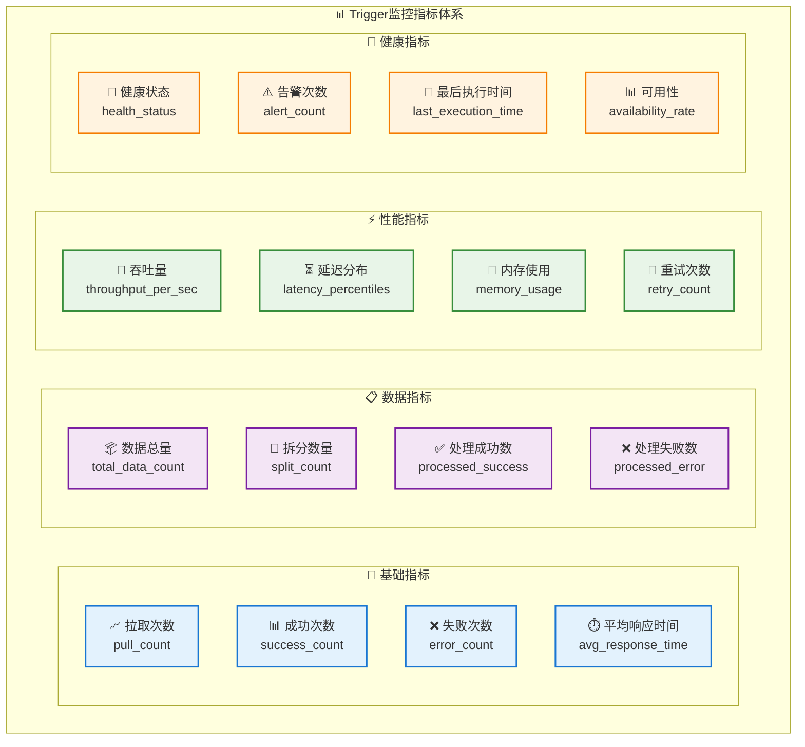

#### 3.10.2 告警规则配置

<augment_code_snippet path="src/main/java/com/effektif/workflow/monitoring/AlertRule.java" mode="EXCERPT">
```java
/**
 * 告警规则配置
 */
@Data
@Builder
public class AlertRule {

    public enum AlertLevel {
        INFO, WARNING, ERROR, CRITICAL
    }

    public enum AlertCondition {
        GREATER_THAN,
        LESS_THAN,
        EQUALS,
        NOT_EQUALS,
        CONTAINS,
        REGEX_MATCH
    }

    private String ruleId;
    private String ruleName;
    private String triggerId;
    private String metricName;
    private AlertCondition condition;
    private Object threshold;
    private AlertLevel level;
    private int evaluationWindow = 300; // 秒
    private int cooldownPeriod = 600; // 秒
    private boolean enabled = true;

    // 告警通知配置
    private List<String> notificationChannels;
    private String messageTemplate;
    private Map<String, Object> customFields;

    /**
     * 评估告警条件
     */
    public boolean evaluate(Object metricValue) {
        if (metricValue == null || threshold == null) {
            return false;
        }

        switch (condition) {
            case GREATER_THAN:
                return compareNumbers(metricValue, threshold) > 0;
            case LESS_THAN:
                return compareNumbers(metricValue, threshold) < 0;
            case EQUALS:
                return Objects.equals(metricValue, threshold);
            case NOT_EQUALS:
                return !Objects.equals(metricValue, threshold);
            case CONTAINS:
                return metricValue.toString().contains(threshold.toString());
            case REGEX_MATCH:
                return metricValue.toString().matches(threshold.toString());
            default:
                return false;
        }
    }

    private int compareNumbers(Object value1, Object value2) {
        if (value1 instanceof Number && value2 instanceof Number) {
            double d1 = ((Number) value1).doubleValue();
            double d2 = ((Number) value2).doubleValue();
            return Double.compare(d1, d2);
        }
        return 0;
    }
}
```
</augment_code_snippet>

## 4. 系统集成和部署方案

### 4.1 与现有系统集成

#### 4.1.1 与Effektif工作流引擎集成

基于现有的Effektif架构，Trigger节点需要与以下组件进行深度集成：

- **WorkflowEngine**: 工作流执行引擎
- **BpmnReader/BpmnWriter**: BPMN流程定义读写
- **TriggerInstance**: 触发器实例管理
- **ExecutionContext**: 执行上下文管理

#### 4.1.2 集成架构图

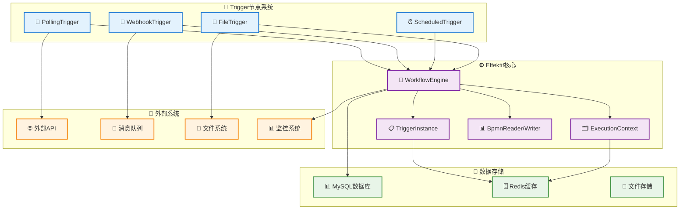

### 4.2 部署架构设计

#### 4.2.1 微服务部署架构

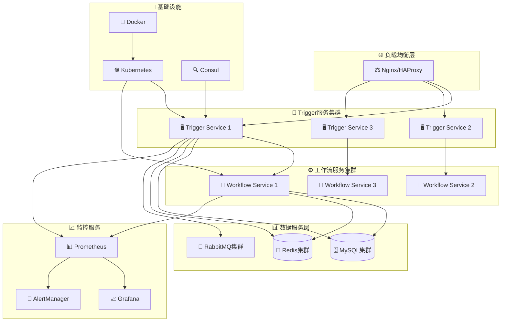

## 5. 原有系统核心类图和数据结构

## 5. 总结与展望

### 5.1 设计总结

本文档基于集成平台2.0的动态编排需求，参考Zapier和n8n的设计理念，设计了一套完整的Trigger节点系统。主要特性包括：

#### 5.1.1 核心特性
✅ **多种触发策略**: 支持轮询、Webhook、定时、文件监听等多种触发方式
✅ **数据自动拆分**: 参考Zapier设计，自动将批量数据拆分为单条处理
✅ **上下文传递**: 完整的执行上下文管理，支持节点间数据流转
✅ **分页支持**: 支持多种分页策略，处理大量数据拉取
✅ **错误处理**: 完善的错误处理、重试机制和死信队列
✅ **监控告警**: 全面的监控指标和告警规则配置

#### 5.1.2 技术优势
- **高可用**: 支持集群部署、故障切换和负载均衡
- **高性能**: 支持并行处理、批量操作和性能优化
- **易扩展**: 插件化架构，支持自定义触发器类型
- **易配置**: 统一的配置管理和可视化配置界面
- **易监控**: 完整的监控体系和告警机制

#### 5.1.3 与现有系统集成
- 与Effektif工作流引擎深度集成
- 保持现有API兼容性
- 支持渐进式迁移和部署

### 5.2 实施建议

#### 5.2.1 分阶段实施
1. **第一阶段**: 实现基础的轮询触发器和数据拆分功能
2. **第二阶段**: 添加Webhook触发器和分页支持
3. **第三阶段**: 完善监控告警和高可用特性
4. **第四阶段**: 优化性能和添加高级特性

#### 5.2.2 技术选型建议
- **开发语言**: Java 8+ (与现有系统保持一致)
- **框架**: Spring Boot 2.x + Spring Cloud
- **数据库**: MySQL 8.0 + Redis 6.x
- **消息队列**: RabbitMQ 3.8+
- **监控**: Prometheus + Grafana
- **容器化**: Docker + Kubernetes

#### 5.2.3 性能目标
- **吞吐量**: 支持每秒处理1000+条数据
- **延迟**: 平均响应时间 < 100ms
- **可用性**: 99.9%以上的服务可用性
- **扩展性**: 支持水平扩展到100+节点

### 5.3 风险评估

#### 5.3.1 技术风险
- **数据一致性**: 分布式环境下的数据一致性保证
- **性能瓶颈**: 大量并发触发器的性能影响
- **兼容性**: 与现有系统的兼容性问题

#### 5.3.2 缓解措施
- 采用分布式锁和事务管理保证数据一致性
- 实施性能测试和容量规划
- 制定详细的兼容性测试计划

### 5.4 未来展望

#### 5.4.1 功能扩展
- **AI驱动**: 集成机器学习算法，智能优化触发策略
- **低代码**: 提供可视化的触发器配置界面
- **多云支持**: 支持多云环境部署和管理
- **实时流处理**: 集成流处理引擎，支持实时数据处理

#### 5.4.2 生态建设
- **开放API**: 提供完整的REST API和SDK
- **插件市场**: 建设触发器插件生态系统
- **社区支持**: 建立开发者社区和文档体系

---

**文档版本**: v2.0
**最后更新**: 2025-01-29
**作者**: 集成平台开发团队
**审核**: 技术架构委员会

### 5.5 原有系统核心类图

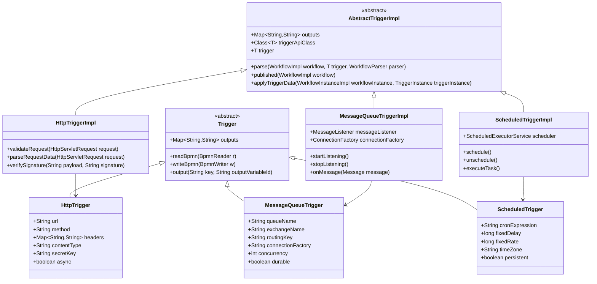

### 3.2 增强版类图（包含Spring Boot集成）

```mermaid
classDiagram
    %% 触发器配置类
    class HttpTrigger {
        🌐 HTTP触发器配置
        +String url "请求URL路径"
        +String method "HTTP方法"
        +String secretKey "签名密钥"
        +boolean async "异步处理"
        +String[] allowedIps "IP白名单"
        +boolean enableSignatureVerification "启用签名验证"
        +String signatureAlgorithm "签名算法"
        +url(String url) HttpTrigger
        +method(String method) HttpTrigger
        +secretKey(String key) HttpTrigger
    }

    class MessageQueueTrigger {
        📨 消息队列触发器配置
        +String queueName "队列名称"
        +String exchangeName "交换机名称"
        +String routingKey "路由键"
        +int concurrency "并发数"
        +boolean durable "持久化"
        +int maxRetries "最大重试次数"
        +String deadLetterQueue "死信队列"
        +boolean enableDeduplication "启用去重"
        +queueName(String name) MessageQueueTrigger
        +concurrency(int count) MessageQueueTrigger
        +maxRetries(int retries) MessageQueueTrigger
    }

    class ScheduledTrigger {
        ⏰ 定时触发器配置
        +String cronExpression "Cron表达式"
        +long fixedDelay "固定延迟"
        +long fixedRate "固定间隔"
        +String timeZone "时区"
        +boolean persistent "持久化"
        +int maxExecutions "最大执行次数"
        +boolean allowConcurrentExecution "允许并发执行"
        +cronExpression(String cron) ScheduledTrigger
        +fixedRate(long rate) ScheduledTrigger
        +timeZone(String zone) ScheduledTrigger
    }

    %% 处理器类
    class HttpTriggerProcessor {
        🌐 HTTP触发器处理器
        +validateRequest(HttpTrigger trigger, HttpServletRequest request) boolean
        +parseRequestData(HttpServletRequest request) Map~String,Object~
        +verifySignature(HttpTrigger trigger, String payload, String signature) boolean
        +getClientIpAddress(HttpServletRequest request) String
    }

    class MessageQueueTriggerProcessor {
        📨 消息队列触发器处理器
        +onMessage(Message message) void
        +startListening() void
        +stopListening() void
        +isDuplicateMessage(Message message) boolean
        +sendToDeadLetterQueue(Message message, Exception error) void
    }

    class ScheduledTriggerProcessor {
        ⏰ 定时触发器处理器
        +ScheduledExecutorService scheduler
        +schedule() void
        +unschedule() void
        +executeTask() void
        +scheduleCronJob() void
    }

    %% Spring Boot集成层
    class TriggerController {
        🎮 触发器REST控制器
        +createTrigger(TriggerConfigDto config) ResponseEntity
        +updateTrigger(String triggerId, TriggerConfigDto config) ResponseEntity
        +getTrigger(String triggerId) ResponseEntity
        +deleteTrigger(String triggerId) ResponseEntity
        +handleHttpTrigger(String triggerId, HttpServletRequest request) ResponseEntity
        +getTriggerExecutionLogs(String triggerId, int page, int size) ResponseEntity
    }

    class TriggerService {
        🔧 触发器业务服务
        +createTrigger(TriggerConfigDto config) TriggerConfigDto
        +updateTrigger(TriggerConfigDto config) TriggerConfigDto
        +deleteTrigger(String triggerId) boolean
        +processHttpTrigger(String triggerId, HttpServletRequest request) Map
        +executeTrigger(String triggerId, Map data) Map
        +buildHttpTriggerFromConfig(TriggerConfig config) HttpTrigger
    }

    class TriggerConfigRepository {
        💾 触发器配置数据访问
        +findByTriggerId(String triggerId) TriggerConfig
        +findByTriggerType(String type, Pageable pageable) Page
        +findByStatus(Integer status, Pageable pageable) Page
        +existsByTriggerId(String triggerId) boolean
        +countByStatus(Integer status) long
    }

    class WorkflowEngine {
        🚀 工作流引擎
        +start(TriggerInstance triggerInstance) WorkflowInstance
        +getProcessInstanceQuery() ProcessInstanceQuery
        +suspendProcessInstance(String processInstanceId) void
        +activateProcessInstance(String processInstanceId) void
    }

    %% 关系定义
    TriggerController --> TriggerService : uses
    TriggerService --> HttpTriggerProcessor : uses
    TriggerService --> MessageQueueTriggerProcessor : uses
    TriggerService --> ScheduledTriggerProcessor : uses
    TriggerService --> TriggerConfigRepository : uses
    TriggerService --> WorkflowEngine : uses

    HttpTriggerProcessor --> HttpTrigger : processes
    MessageQueueTriggerProcessor --> MessageQueueTrigger : processes
    ScheduledTriggerProcessor --> ScheduledTrigger : processes

    %% 样式定义
    classDef triggerConfig fill:#e3f2fd,stroke:#1976d2,stroke-width:2px,color:#000
    classDef processor fill:#f3e5f5,stroke:#7b1fa2,stroke-width:2px,color:#000
    classDef springBoot fill:#e8f5e8,stroke:#388e3c,stroke-width:2px,color:#000
    classDef repository fill:#fff3e0,stroke:#f57c00,stroke-width:2px,color:#000
    classDef engine fill:#fce4ec,stroke:#c2185b,stroke-width:2px,color:#000

    class HttpTrigger,MessageQueueTrigger,ScheduledTrigger triggerConfig
    class HttpTriggerProcessor,MessageQueueTriggerProcessor,ScheduledTriggerProcessor processor
    class TriggerController,TriggerService springBoot
    class TriggerConfigRepository repository
    class WorkflowEngine engine
```

### 3.3 数据库表结构设计

#### 3.2.1 trigger_config表 - 触发器配置表
```sql
CREATE TABLE trigger_config (
    id BIGINT PRIMARY KEY AUTO_INCREMENT,
    trigger_id VARCHAR(64) NOT NULL UNIQUE COMMENT '触发器ID',
    trigger_type VARCHAR(32) NOT NULL COMMENT '触发器类型',
    workflow_id VARCHAR(64) NOT NULL COMMENT '关联的工作流ID',
    name VARCHAR(128) NOT NULL COMMENT '触发器名称',
    description TEXT COMMENT '描述',
    config_json TEXT NOT NULL COMMENT '触发器配置JSON',
    status TINYINT DEFAULT 1 COMMENT '状态：0-禁用，1-启用',
    created_time TIMESTAMP DEFAULT CURRENT_TIMESTAMP,
    updated_time TIMESTAMP DEFAULT CURRENT_TIMESTAMP ON UPDATE CURRENT_TIMESTAMP,
    created_by VARCHAR(64) COMMENT '创建人',
    updated_by VARCHAR(64) COMMENT '更新人',
    INDEX idx_trigger_type (trigger_type),
    INDEX idx_workflow_id (workflow_id),
    INDEX idx_status (status)
);
```

#### 3.2.2 trigger_execution_log表 - 触发器执行日志表
```sql
CREATE TABLE trigger_execution_log (
    id BIGINT PRIMARY KEY AUTO_INCREMENT,
    trigger_id VARCHAR(64) NOT NULL COMMENT '触发器ID',
    workflow_instance_id VARCHAR(64) COMMENT '工作流实例ID',
    execution_id VARCHAR(64) NOT NULL COMMENT '执行ID',
    trigger_data TEXT COMMENT '触发数据',
    execution_status TINYINT NOT NULL COMMENT '执行状态：0-失败，1-成功，2-处理中',
    error_message TEXT COMMENT '错误信息',
    execution_time TIMESTAMP DEFAULT CURRENT_TIMESTAMP COMMENT '执行时间',
    duration_ms BIGINT COMMENT '执行耗时(毫秒)',
    INDEX idx_trigger_id (trigger_id),
    INDEX idx_workflow_instance_id (workflow_instance_id),
    INDEX idx_execution_status (execution_status),
    INDEX idx_execution_time (execution_time)
);
```

### 3.3 核心方法描述

#### 3.3.1 HttpTriggerImpl核心方法
```java
public class HttpTriggerImpl extends AbstractTriggerImpl<HttpTrigger> {

    /**
     * 验证HTTP请求的合法性
     * @param request HTTP请求对象
     * @return 验证结果
     */
    public boolean validateRequest(HttpServletRequest request) {
        // 验证请求方法
        // 验证Content-Type
        // 验证签名
        // 验证IP白名单
    }

    /**
     * 解析HTTP请求数据
     * @param request HTTP请求对象
     * @return 解析后的数据Map
     */
    public Map<String, Object> parseRequestData(HttpServletRequest request) {
        // 根据Content-Type解析请求体
        // 提取请求头信息
        // 提取查询参数
    }

    /**
     * 验证请求签名
     * @param payload 请求载荷
     * @param signature 签名
     * @return 验证结果
     */
    public boolean verifySignature(String payload, String signature) {
        // 使用HMAC-SHA256验证签名
    }
}
```

#### 3.3.2 MessageQueueTriggerImpl核心方法
```java
public class MessageQueueTriggerImpl extends AbstractTriggerImpl<MessageQueueTrigger> {

    /**
     * 开始监听消息队列
     */
    public void startListening() {
        // 创建连接工厂
        // 创建消息监听器
        // 绑定队列和交换机
        // 开始消费消息
    }

    /**
     * 停止监听消息队列
     */
    public void stopListening() {
        // 停止消息消费
        // 关闭连接
        // 清理资源
    }

    /**
     * 处理接收到的消息
     * @param message 消息对象
     */
    public void onMessage(Message message) {
        // 解析消息内容
        // 创建TriggerInstance
        // 启动工作流
        // 确认消息
    }
}
```

## 4. 核心场景测试用例

### 4.1 功能测试用例

#### 4.1.1 HTTP触发器测试用例

**测试用例1: HTTP POST触发工作流**
- **前置条件**: 已配置HTTP触发器，关联到测试工作流
- **测试步骤**:
  1. 发送POST请求到触发器URL
  2. 请求体包含JSON数据
  3. 设置正确的签名头
- **预期结果**: 工作流成功启动，返回200状态码
- **验证点**: 工作流实例创建，变量正确设置

**测试用例2: HTTP签名验证失败**
- **前置条件**: 已配置HTTP触发器，启用签名验证
- **测试步骤**: 发送请求但签名错误
- **预期结果**: 返回401未授权状态码
- **验证点**: 工作流未启动，记录安全日志

#### 4.1.2 消息队列触发器测试用例

**测试用例3: RabbitMQ消息触发工作流**
- **前置条件**: 已配置RabbitMQ触发器
- **测试步骤**: 向指定队列发送消息
- **预期结果**: 工作流成功启动
- **验证点**: 消息被正确消费，工作流变量设置正确

**测试用例4: 消息处理失败重试**
- **前置条件**: 已配置消息队列触发器，启用重试机制
- **测试步骤**: 发送消息，模拟工作流执行失败
- **预期结果**: 消息进入重试队列，达到最大重试次数后进入死信队列
- **验证点**: 重试次数正确，死信队列有消息

#### 4.1.3 定时触发器测试用例

**测试用例5: Cron表达式定时触发**
- **前置条件**: 已配置定时触发器，Cron表达式为每分钟执行
- **测试步骤**: 等待触发时间到达
- **预期结果**: 工作流按时启动
- **验证点**: 触发时间准确，工作流实例创建

### 4.2 压力测试用例

#### 4.2.1 HTTP触发器并发测试
- **测试目标**: 验证HTTP触发器的并发处理能力
- **测试方法**: 使用JMeter模拟1000个并发请求
- **性能指标**:
  - TPS > 500
  - 平均响应时间 < 100ms
  - 错误率 < 0.1%
- **资源监控**: CPU使用率、内存使用率、数据库连接数

#### 4.2.2 消息队列触发器吞吐量测试
- **测试目标**: 验证消息队列触发器的消息处理能力
- **测试方法**: 向队列发送10000条消息
- **性能指标**:
  - 消息处理速度 > 1000 msg/s
  - 消息丢失率 = 0%
  - 内存使用稳定
- **资源监控**: 队列深度、消费者线程数、GC频率

#### 4.2.3 定时触发器稳定性测试
- **测试目标**: 验证定时触发器长期运行的稳定性
- **测试方法**: 配置多个定时任务，运行24小时
- **性能指标**:
  - 触发准确率 > 99.9%
  - 内存泄漏检测通过
  - 系统资源使用稳定
- **资源监控**: 内存使用趋势、线程数变化、定时任务执行日志

### 4.3 集成测试用例

#### 4.3.1 多触发器协同测试
- **测试场景**: HTTP触发器启动工作流，工作流中包含定时等待，消息队列触发器推进流程
- **验证点**: 多个触发器能够正确协同工作，数据传递无误

#### 4.3.2 故障恢复测试
- **测试场景**: 系统重启后，定时触发器和消息队列监听器能够自动恢复
- **验证点**: 触发器状态正确恢复，未处理的消息能够继续处理

## 5. 技术实现要点

### 5.1 Spring Boot集成
- 使用Spring Boot Starter自动配置
- 支持配置文件外部化
- 集成Spring Security进行安全控制
- 使用Spring Data JPA进行数据持久化

### 5.2 高可用设计
- 支持集群部署，避免单点故障
- 使用分布式锁确保定时任务不重复执行
- 消息队列支持高可用配置
- 数据库连接池和读写分离

### 5.3 监控和运维
- 集成Micrometer进行指标监控
- 使用ELK Stack进行日志分析
- 支持健康检查和优雅关闭
- 提供管理API进行运维操作

### 5.4 安全考虑
- HTTP触发器支持HTTPS和签名验证
- 敏感配置信息加密存储
- 支持IP白名单和访问频率限制
- 审计日志记录所有关键操作

## 6. 完整的测试用例设计

### 6.1 单元测试用例

#### 6.1.1 HttpTriggerImpl测试用例

**测试类**: `HttpTriggerImplTest`

```java
@ExtendWith(MockitoExtension.class)
class HttpTriggerImplTest {

    @Test
    void testValidateRequest_ValidRequest_ReturnsTrue() {
        // 测试有效请求验证
        HttpTrigger trigger = new HttpTrigger()
            .method("POST")
            .contentType("application/json")
            .enableSignatureVerification(false);

        HttpTriggerImpl impl = new HttpTriggerImpl();
        impl.trigger = trigger;

        HttpServletRequest request = mockValidRequest();
        assertTrue(impl.validateRequest(request));
    }

    @Test
    void testValidateRequest_InvalidMethod_ReturnsFalse() {
        // 测试无效HTTP方法
        HttpTrigger trigger = new HttpTrigger().method("POST");
        HttpTriggerImpl impl = new HttpTriggerImpl();
        impl.trigger = trigger;

        HttpServletRequest request = mockRequest("GET");
        assertFalse(impl.validateRequest(request));
    }

    @Test
    void testVerifySignature_ValidSignature_ReturnsTrue() {
        // 测试有效签名验证
        HttpTrigger trigger = new HttpTrigger()
            .secretKey("test-secret")
            .signatureAlgorithm("HmacSHA256");

        HttpTriggerImpl impl = new HttpTriggerImpl();
        impl.trigger = trigger;

        String payload = "{\"test\": \"data\"}";
        String signature = generateValidSignature(payload, "test-secret");

        assertTrue(impl.verifySignature(payload, signature));
    }

    @Test
    void testParseRequestData_JsonPayload_ParsesCorrectly() {
        // 测试JSON数据解析
        HttpServletRequest request = mockJsonRequest();
        HttpTriggerImpl impl = new HttpTriggerImpl();

        Map<String, Object> data = impl.parseRequestData(request);

        assertNotNull(data);
        assertEquals("POST", data.get("httpMethod"));
        assertNotNull(data.get("jsonPayload"));
        assertNotNull(data.get("headers"));
    }
}
```

#### 6.1.2 MessageQueueTriggerImpl测试用例

**测试类**: `MessageQueueTriggerImplTest`

```java
@ExtendWith(MockitoExtension.class)
class MessageQueueTriggerImplTest {

    @Mock
    private ConnectionFactory connectionFactory;

    @Mock
    private SimpleMessageListenerContainer listenerContainer;

    @Test
    void testOnMessage_ValidMessage_ProcessesSuccessfully() {
        // 测试有效消息处理
        MessageQueueTrigger trigger = new MessageQueueTrigger()
            .queueName("test.queue")
            .messageType("java.lang.String");

        MessageQueueTriggerImpl impl = new MessageQueueTriggerImpl();
        impl.trigger = trigger;

        Message message = mockMessage("{\"orderId\": \"12345\"}");

        assertDoesNotThrow(() -> impl.onMessage(message));
    }

    @Test
    void testIsDuplicateMessage_EnabledDeduplication_DetectsDuplicate() {
        // 测试消息去重
        MessageQueueTrigger trigger = new MessageQueueTrigger()
            .enableDeduplication(true)
            .deduplicationKey("headers['messageId']");

        MessageQueueTriggerImpl impl = new MessageQueueTriggerImpl();
        impl.trigger = trigger;

        Message message1 = mockMessageWithId("msg-001");
        Message message2 = mockMessageWithId("msg-001");

        assertFalse(impl.isDuplicateMessage(message1));
        impl.recordMessageForDeduplication(message1);
        assertTrue(impl.isDuplicateMessage(message2));
    }

    @Test
    void testHandleMessageError_ExceedsMaxRetries_SendsToDeadLetterQueue() {
        // 测试重试机制和死信队列
        MessageQueueTrigger trigger = new MessageQueueTrigger()
            .maxRetries(3)
            .deadLetterQueue("test.dlq");

        MessageQueueTriggerImpl impl = new MessageQueueTriggerImpl();
        impl.trigger = trigger;

        Message message = mockMessage("invalid-json");
        Exception error = new RuntimeException("Parse error");

        // 模拟多次重试
        for (int i = 0; i <= 3; i++) {
            impl.handleMessageError(message, error);
        }

        // 验证消息被发送到死信队列
        verify(impl, times(1)).sendToDeadLetterQueue(message, error);
    }
}
```

#### 6.1.3 ScheduledTriggerImpl测试用例

**测试类**: `ScheduledTriggerImplTest`

```java
@ExtendWith(MockitoExtension.class)
class ScheduledTriggerImplTest {

    @Mock
    private ScheduledExecutorService scheduler;

    @Test
    void testScheduleCronJob_ValidCronExpression_SchedulesSuccessfully() {
        // 测试Cron表达式调度
        ScheduledTrigger trigger = new ScheduledTrigger()
            .cronExpression("0 0 2 * * ?")
            .timeZone("Asia/Shanghai");

        ScheduledTriggerImpl impl = new ScheduledTriggerImpl();
        impl.trigger = trigger;
        impl.scheduler = scheduler;

        assertDoesNotThrow(() -> impl.scheduleCronJob());
        verify(scheduler, times(1)).schedule(any(Runnable.class), anyLong(), eq(TimeUnit.MILLISECONDS));
    }

    @Test
    void testExecuteTask_MaxExecutionsReached_StopsExecution() {
        // 测试最大执行次数限制
        ScheduledTrigger trigger = new ScheduledTrigger()
            .maxExecutions(5);

        ScheduledTriggerImpl impl = new ScheduledTriggerImpl();
        impl.trigger = trigger;

        // 执行6次，第6次应该停止
        for (int i = 1; i <= 6; i++) {
            impl.executeTask();
        }

        verify(impl, times(1)).unschedule();
    }

    @Test
    void testExecuteTask_ConcurrentExecutionDisabled_SkipsOverlappingExecution() {
        // 测试并发执行控制
        ScheduledTrigger trigger = new ScheduledTrigger()
            .allowConcurrentExecution(false);

        ScheduledTriggerImpl impl = new ScheduledTriggerImpl();
        impl.trigger = trigger;

        // 模拟并发执行
        CompletableFuture<Void> future1 = CompletableFuture.runAsync(impl::executeTask);
        CompletableFuture<Void> future2 = CompletableFuture.runAsync(impl::executeTask);

        CompletableFuture.allOf(future1, future2).join();

        // 验证只有一个执行成功
        verify(impl.workflowEngine, times(1)).start(any(TriggerInstance.class));
    }
}
```

### 6.2 集成测试用例

#### 6.2.1 TriggerService集成测试

**测试类**: `TriggerServiceIntegrationTest`

```java
@SpringBootTest
@Transactional
@TestPropertySource(locations = "classpath:application-test.properties")
class TriggerServiceIntegrationTest {

    @Autowired
    private TriggerService triggerService;

    @Autowired
    private TriggerConfigRepository triggerConfigRepository;

    @Autowired
    private TriggerExecutionLogRepository executionLogRepository;

    @Test
    void testCreateTrigger_ValidConfig_SavesSuccessfully() {
        // 测试触发器创建
        TriggerConfigDto config = createValidHttpTriggerConfig();

        TriggerConfigDto created = triggerService.createTrigger(config);

        assertNotNull(created);
        assertEquals(config.getTriggerId(), created.getTriggerId());

        // 验证数据库记录
        TriggerConfig entity = triggerConfigRepository.findByTriggerId(config.getTriggerId());
        assertNotNull(entity);
        assertEquals(config.getName(), entity.getName());
    }

    @Test
    void testProcessHttpTrigger_ValidRequest_StartsWorkflow() {
        // 测试HTTP触发器处理
        TriggerConfigDto config = createValidHttpTriggerConfig();
        triggerService.createTrigger(config);

        MockHttpServletRequest request = new MockHttpServletRequest();
        request.setMethod("POST");
        request.setContentType("application/json");
        request.setContent("{\"orderId\": \"12345\"}".getBytes());

        Map<String, Object> result = triggerService.processHttpTrigger(config.getTriggerId(), request);

        assertTrue((Boolean) result.get("success"));
        assertNotNull(result.get("executionId"));
        assertNotNull(result.get("workflowInstanceId"));

        // 验证执行日志
        List<TriggerExecutionLogDto> logs = triggerService.getTriggerExecutionLogs(config.getTriggerId(), 0, 10);
        assertEquals(1, logs.size());
        assertEquals(1, logs.get(0).getExecutionStatus().intValue());
    }

    @Test
    void testUpdateTriggerStatus_DisableTrigger_StopsListening() {
        // 测试触发器状态更新
        TriggerConfigDto config = createValidScheduledTriggerConfig();
        triggerService.createTrigger(config);

        boolean updated = triggerService.updateTriggerStatus(config.getTriggerId(), false);

        assertTrue(updated);

        TriggerConfig entity = triggerConfigRepository.findByTriggerId(config.getTriggerId());
        assertEquals(0, entity.getStatus().intValue());
    }
}
```

### 6.3 端到端测试用例

#### 6.3.1 HTTP触发器端到端测试

**测试类**: `HttpTriggerE2ETest`

```java
@SpringBootTest(webEnvironment = SpringBootTest.WebEnvironment.RANDOM_PORT)
@TestPropertySource(locations = "classpath:application-test.properties")
class HttpTriggerE2ETest {

    @Autowired
    private TestRestTemplate restTemplate;

    @LocalServerPort
    private int port;

    @Test
    void testHttpTriggerWorkflow_CompleteFlow_ExecutesSuccessfully() {
        // 1. 创建触发器
        TriggerConfigDto config = createHttpTriggerConfig();
        ResponseEntity<TriggerConfigDto> createResponse = restTemplate.postForEntity(
            "/api/triggers", config, TriggerConfigDto.class);
        assertEquals(HttpStatus.CREATED, createResponse.getStatusCode());

        // 2. 触发HTTP请求
        HttpHeaders headers = new HttpHeaders();
        headers.setContentType(MediaType.APPLICATION_JSON);
        headers.set("X-Signature", generateSignature("{\"orderId\": \"12345\"}", "test-secret"));

        HttpEntity<String> request = new HttpEntity<>("{\"orderId\": \"12345\"}", headers);
        ResponseEntity<Map> triggerResponse = restTemplate.postForEntity(
            "/api/triggers/http/" + config.getTriggerId(), request, Map.class);

        assertEquals(HttpStatus.OK, triggerResponse.getStatusCode());
        assertTrue((Boolean) triggerResponse.getBody().get("success"));

        // 3. 验证执行日志
        ResponseEntity<List> logsResponse = restTemplate.getForEntity(
            "/api/triggers/" + config.getTriggerId() + "/logs", List.class);
        assertEquals(HttpStatus.OK, logsResponse.getStatusCode());
        assertFalse(logsResponse.getBody().isEmpty());

        // 4. 清理
        restTemplate.delete("/api/triggers/" + config.getTriggerId());
    }
}
```

### 6.4 压力测试用例

#### 6.4.1 HTTP触发器并发压力测试

**JMeter测试计划**: `http-trigger-load-test.jmx`

```xml
<?xml version="1.0" encoding="UTF-8"?>
<jmeterTestPlan version="1.2">
  <hashTree>
    <TestPlan guiclass="TestPlanGui" testclass="TestPlan" testname="HTTP触发器压力测试">
      <elementProp name="TestPlan.arguments" elementType="Arguments" guiclass="ArgumentsPanel">
        <collectionProp name="Arguments.arguments"/>
      </elementProp>
      <stringProp name="TestPlan.user_define_classpath"></stringProp>
      <boolProp name="TestPlan.serialize_threadgroups">false</boolProp>
      <boolProp name="TestPlan.functional_mode">false</boolProp>
    </TestPlan>
    <hashTree>
      <ThreadGroup guiclass="ThreadGroupGui" testclass="ThreadGroup" testname="并发用户组">
        <stringProp name="ThreadGroup.on_sample_error">continue</stringProp>
        <elementProp name="ThreadGroup.main_controller" elementType="LoopController">
          <boolProp name="LoopController.continue_forever">false</boolProp>
          <stringProp name="LoopController.loops">100</stringProp>
        </elementProp>
        <stringProp name="ThreadGroup.num_threads">50</stringProp>
        <stringProp name="ThreadGroup.ramp_time">10</stringProp>
        <longProp name="ThreadGroup.start_time">1</longProp>
        <longProp name="ThreadGroup.end_time">1</longProp>
        <boolProp name="ThreadGroup.scheduler">false</boolProp>
        <stringProp name="ThreadGroup.duration"></stringProp>
        <stringProp name="ThreadGroup.delay"></stringProp>
      </ThreadGroup>
      <hashTree>
        <HTTPSamplerProxy guiclass="HttpTestSampleGui" testclass="HTTPSamplerProxy" testname="HTTP触发器请求">
          <elementProp name="HTTPsampler.Arguments" elementType="Arguments">
            <collectionProp name="Arguments.arguments">
              <elementProp name="" elementType="HTTPArgument">
                <boolProp name="HTTPArgument.always_encode">false</boolProp>
                <stringProp name="Argument.value">{"orderId": "${__UUID()}", "amount": ${__Random(100,1000)}, "timestamp": ${__time()}}</stringProp>
                <stringProp name="Argument.metadata">=</stringProp>
              </elementProp>
            </collectionProp>
          </elementProp>
          <stringProp name="HTTPSampler.domain">localhost</stringProp>
          <stringProp name="HTTPSampler.port">8080</stringProp>
          <stringProp name="HTTPSampler.protocol">http</stringProp>
          <stringProp name="HTTPSampler.contentEncoding"></stringProp>
          <stringProp name="HTTPSampler.path">/api/triggers/http/load-test-trigger</stringProp>
          <stringProp name="HTTPSampler.method">POST</stringProp>
          <boolProp name="HTTPSampler.follow_redirects">true</boolProp>
          <boolProp name="HTTPSampler.auto_redirects">false</boolProp>
          <boolProp name="HTTPSampler.use_keepalive">true</boolProp>
          <boolProp name="HTTPSampler.DO_MULTIPART_POST">false</boolProp>
          <stringProp name="HTTPSampler.embedded_url_re"></stringProp>
          <stringProp name="HTTPSampler.connect_timeout"></stringProp>
          <stringProp name="HTTPSampler.response_timeout"></stringProp>
        </HTTPSamplerProxy>
        <hashTree>
          <HeaderManager guiclass="HeaderPanel" testclass="HeaderManager" testname="HTTP头管理器">
            <collectionProp name="HeaderManager.headers">
              <elementProp name="" elementType="Header">
                <stringProp name="Header.name">Content-Type</stringProp>
                <stringProp name="Header.value">application/json</stringProp>
              </elementProp>
            </collectionProp>
          </HeaderManager>
          <hashTree/>
          <ResponseAssertion guiclass="AssertionGui" testclass="ResponseAssertion" testname="响应断言">
            <collectionProp name="Asserion.test_strings">
              <stringProp name="49586">200</stringProp>
            </collectionProp>
            <stringProp name="Assertion.test_field">Assertion.response_code</stringProp>
            <boolProp name="Assertion.assume_success">false</boolProp>
            <intProp name="Assertion.test_type">1</intProp>
          </ResponseAssertion>
          <hashTree/>
        </hashTree>
      </hashTree>
    </hashTree>
  </hashTree>
</jmeterTestPlan>
```

#### 6.4.2 性能基准测试

**测试目标**:
- **HTTP触发器**: TPS > 500, 平均响应时间 < 100ms, 错误率 < 0.1%
- **消息队列触发器**: 消息处理速度 > 1000 msg/s, 消息丢失率 = 0%
- **定时触发器**: 触发准确率 > 99.9%, 内存使用稳定

**测试脚本**: `performance-benchmark.sh`

```bash
#!/bin/bash

# HTTP触发器性能测试
echo "开始HTTP触发器性能测试..."
jmeter -n -t tests/http-trigger-load-test.jmx -l results/http-results.jtl -e -o results/http-report

# 分析结果
echo "HTTP触发器测试结果:"
awk -F',' 'NR>1 {sum+=$2; count++; if($4=="true") success++} END {
    print "平均响应时间: " sum/count "ms"
    print "成功率: " (success/count)*100 "%"
    print "TPS: " count/60
}' results/http-results.jtl

# 消息队列触发器性能测试
echo "开始消息队列触发器性能测试..."
python3 tests/mq-performance-test.py

# 定时触发器稳定性测试
echo "开始定时触发器稳定性测试..."
python3 tests/scheduled-trigger-stability-test.py

echo "所有性能测试完成!"
```

### 6.5 测试数据管理

#### 6.5.1 测试数据准备

**测试数据工厂**: `TestDataFactory.java`

```java
@Component
public class TestDataFactory {

    public TriggerConfigDto createHttpTriggerConfig(String triggerId) {
        TriggerConfigDto config = new TriggerConfigDto();
        config.setTriggerId(triggerId);
        config.setTriggerType("httpTrigger");
        config.setWorkflowId("test-workflow-" + triggerId);
        config.setName("测试HTTP触发器-" + triggerId);
        config.setDescription("用于测试的HTTP触发器");
        config.setStatus(1);
        config.setCreatedBy("test-user");
        config.setUpdatedBy("test-user");

        Map<String, Object> httpConfig = new HashMap<>();
        httpConfig.put("url", "/webhooks/" + triggerId);
        httpConfig.put("method", "POST");
        httpConfig.put("secretKey", "test-secret-" + triggerId);
        httpConfig.put("contentType", "application/json");
        httpConfig.put("async", true);
        httpConfig.put("enableSignatureVerification", false);
        config.setConfig(httpConfig);

        return config;
    }

    public TriggerConfigDto createScheduledTriggerConfig(String triggerId) {
        TriggerConfigDto config = new TriggerConfigDto();
        config.setTriggerId(triggerId);
        config.setTriggerType("scheduledTrigger");
        config.setWorkflowId("test-workflow-" + triggerId);
        config.setName("测试定时触发器-" + triggerId);
        config.setDescription("用于测试的定时触发器");
        config.setStatus(1);
        config.setCreatedBy("test-user");
        config.setUpdatedBy("test-user");

        Map<String, Object> scheduledConfig = new HashMap<>();
        scheduledConfig.put("fixedRate", 60000); // 1分钟
        scheduledConfig.put("initialDelay", 5000); // 5秒延迟
        scheduledConfig.put("persistent", false);
        scheduledConfig.put("allowConcurrentExecution", false);
        config.setConfig(scheduledConfig);

        return config;
    }

    public List<TriggerExecutionLogDto> createExecutionLogs(String triggerId, int count) {
        List<TriggerExecutionLogDto> logs = new ArrayList<>();

        for (int i = 1; i <= count; i++) {
            TriggerExecutionLogDto log = new TriggerExecutionLogDto();
            log.setTriggerId(triggerId);
            log.setWorkflowInstanceId("wf-instance-" + i);
            log.setExecutionId("exec-" + triggerId + "-" + i);
            log.setExecutionStatus(i % 10 == 0 ? 0 : 1); // 10%失败率
            log.setExecutionTime(LocalDateTime.now().minusMinutes(count - i));
            log.setDurationMs((long) (Math.random() * 5000 + 500)); // 500-5500ms

            Map<String, Object> triggerData = new HashMap<>();
            triggerData.put("testId", i);
            triggerData.put("timestamp", System.currentTimeMillis());
            log.setTriggerData(triggerData);

            if (log.getExecutionStatus() == 0) {
                log.setErrorMessage("模拟错误: 网络超时");
            }

            logs.add(log);
        }

        return logs;
    }
}
```

#### 6.5.2 测试环境清理

**测试清理工具**: `TestCleanupUtil.java`

```java
@Component
public class TestCleanupUtil {

    @Autowired
    private TriggerConfigRepository triggerConfigRepository;

    @Autowired
    private TriggerExecutionLogRepository executionLogRepository;

    @Transactional
    public void cleanupTestData() {
        // 清理测试触发器配置
        List<TriggerConfig> testTriggers = triggerConfigRepository.findAll().stream()
            .filter(t -> t.getTriggerId().startsWith("test-") ||
                        t.getCreatedBy().equals("test-user"))
            .collect(Collectors.toList());

        for (TriggerConfig trigger : testTriggers) {
            // 先删除执行日志
            executionLogRepository.deleteByTriggerId(trigger.getTriggerId());
            // 再删除触发器配置
            triggerConfigRepository.delete(trigger);
        }

        log.info("清理了 {} 个测试触发器配置", testTriggers.size());
    }

    @Transactional
    public void cleanupOldExecutionLogs(int daysToKeep) {
        LocalDateTime cutoffTime = LocalDateTime.now().minusDays(daysToKeep);
        int deletedCount = executionLogRepository.deleteByExecutionTimeBefore(cutoffTime);
        log.info("清理了 {} 条过期执行日志", deletedCount);
    }
}
```

## 7. 部署和运维指南

### 7.1 Docker容器化部署

#### 7.1.1 Dockerfile

```dockerfile
FROM openjdk:8-jre-alpine

# 设置工作目录
WORKDIR /app

# 安装必要的工具
RUN apk add --no-cache curl

# 复制应用程序
COPY target/effektif-integration-platform-2.0.0.jar app.jar

# 创建非root用户
RUN addgroup -g 1001 effektif && \
    adduser -D -s /bin/sh -u 1001 -G effektif effektif

# 创建日志目录
RUN mkdir -p /var/log/effektif && \
    chown -R effektif:effektif /var/log/effektif

# 切换到非root用户
USER effektif

# 健康检查
HEALTHCHECK --interval=30s --timeout=10s --start-period=60s --retries=3 \
    CMD curl -f http://localhost:8080/api/actuator/health || exit 1

# 暴露端口
EXPOSE 8080

# 启动应用
ENTRYPOINT ["java", "-Djava.security.egd=file:/dev/./urandom", "-jar", "/app/app.jar"]
```

#### 7.1.2 Docker Compose配置

```yaml
version: '3.8'

services:
  effektif-integration-platform:
    build: .
    ports:
      - "8080:8080"
    environment:
      - SPRING_PROFILES_ACTIVE=production
      - DATABASE_URL=jdbc:mysql://mysql:3306/effektif_integration
      - DATABASE_USERNAME=effektif
      - DATABASE_PASSWORD=effektif123
      - RABBITMQ_HOST=rabbitmq
      - MONGODB_HOST=mongodb
    depends_on:
      - mysql
      - rabbitmq
      - mongodb
    volumes:
      - ./logs:/var/log/effektif
    restart: unless-stopped

  mysql:
    image: mysql:8.0
    environment:
      - MYSQL_ROOT_PASSWORD=root123
      - MYSQL_DATABASE=effektif_integration
      - MYSQL_USER=effektif
      - MYSQL_PASSWORD=effektif123
    volumes:
      - mysql_data:/var/lib/mysql
      - ./init.sql:/docker-entrypoint-initdb.d/init.sql
    ports:
      - "3306:3306"
    restart: unless-stopped

  rabbitmq:
    image: rabbitmq:3.8-management
    environment:
      - RABBITMQ_DEFAULT_USER=effektif
      - RABBITMQ_DEFAULT_PASS=effektif123
    ports:
      - "5672:5672"
      - "15672:15672"
    volumes:
      - rabbitmq_data:/var/lib/rabbitmq
    restart: unless-stopped

  mongodb:
    image: mongo:4.4
    environment:
      - MONGO_INITDB_ROOT_USERNAME=effektif
      - MONGO_INITDB_ROOT_PASSWORD=effektif123
      - MONGO_INITDB_DATABASE=effektif
    ports:
      - "27017:27017"
    volumes:
      - mongodb_data:/data/db
    restart: unless-stopped

  prometheus:
    image: prom/prometheus:latest
    ports:
      - "9090:9090"
    volumes:
      - ./prometheus.yml:/etc/prometheus/prometheus.yml
      - prometheus_data:/prometheus
    command:
      - '--config.file=/etc/prometheus/prometheus.yml'
      - '--storage.tsdb.path=/prometheus'
      - '--web.console.libraries=/etc/prometheus/console_libraries'
      - '--web.console.templates=/etc/prometheus/consoles'
    restart: unless-stopped

  grafana:
    image: grafana/grafana:latest
    ports:
      - "3000:3000"
    environment:
      - GF_SECURITY_ADMIN_PASSWORD=admin123
    volumes:
      - grafana_data:/var/lib/grafana
      - ./grafana/dashboards:/etc/grafana/provisioning/dashboards
      - ./grafana/datasources:/etc/grafana/provisioning/datasources
    restart: unless-stopped

volumes:
  mysql_data:
  rabbitmq_data:
  mongodb_data:
  prometheus_data:
  grafana_data:
```

### 7.2 Kubernetes部署

#### 7.2.1 部署清单

```yaml
apiVersion: apps/v1
kind: Deployment
metadata:
  name: effektif-integration-platform
  labels:
    app: effektif-integration-platform
spec:
  replicas: 3
  selector:
    matchLabels:
      app: effektif-integration-platform
  template:
    metadata:
      labels:
        app: effektif-integration-platform
    spec:
      containers:
      - name: app
        image: effektif-integration-platform:2.0.0
        ports:
        - containerPort: 8080
        env:
        - name: SPRING_PROFILES_ACTIVE
          value: "production"
        - name: DATABASE_URL
          valueFrom:
            secretKeyRef:
              name: db-secret
              key: url
        - name: DATABASE_USERNAME
          valueFrom:
            secretKeyRef:
              name: db-secret
              key: username
        - name: DATABASE_PASSWORD
          valueFrom:
            secretKeyRef:
              name: db-secret
              key: password
        resources:
          requests:
            memory: "512Mi"
            cpu: "500m"
          limits:
            memory: "1Gi"
            cpu: "1000m"
        livenessProbe:
          httpGet:
            path: /api/actuator/health
            port: 8080
          initialDelaySeconds: 60
          periodSeconds: 30
        readinessProbe:
          httpGet:
            path: /api/actuator/health
            port: 8080
          initialDelaySeconds: 30
          periodSeconds: 10
        volumeMounts:
        - name: logs
          mountPath: /var/log/effektif
      volumes:
      - name: logs
        persistentVolumeClaim:
          claimName: effektif-logs-pvc
---
apiVersion: v1
kind: Service
metadata:
  name: effektif-integration-platform-service
spec:
  selector:
    app: effektif-integration-platform
  ports:
  - protocol: TCP
    port: 80
    targetPort: 8080
  type: LoadBalancer
---
apiVersion: networking.k8s.io/v1
kind: Ingress
metadata:
  name: effektif-integration-platform-ingress
  annotations:
    kubernetes.io/ingress.class: nginx
    cert-manager.io/cluster-issuer: letsencrypt-prod
spec:
  tls:
  - hosts:
    - api.effektif.example.com
    secretName: effektif-tls
  rules:
  - host: api.effektif.example.com
    http:
      paths:
      - path: /
        pathType: Prefix
        backend:
          service:
            name: effektif-integration-platform-service
            port:
              number: 80
```

### 7.3 部署架构图

```mermaid
graph TB
    subgraph "🌐 负载均衡层"
        LB[🔄 Load Balancer<br/>Nginx/HAProxy]
    end

    subgraph "🏗️ 应用层 (Kubernetes)"
        subgraph "Pod 1"
            APP1[📦 Integration Platform<br/>Instance 1]
        end
        subgraph "Pod 2"
            APP2[📦 Integration Platform<br/>Instance 2]
        end
        subgraph "Pod 3"
            APP3[📦 Integration Platform<br/>Instance 3]
        end
    end

    subgraph "💾 数据存储层"
        subgraph "数据库集群"
            MYSQL_M[🗄️ MySQL Master]
            MYSQL_S1[🗄️ MySQL Slave 1]
            MYSQL_S2[🗄️ MySQL Slave 2]
        end

        subgraph "消息队列集群"
            RABBIT1[📨 RabbitMQ Node 1]
            RABBIT2[📨 RabbitMQ Node 2]
            RABBIT3[📨 RabbitMQ Node 3]
        end

        subgraph "工作流存储"
            MONGO1[🍃 MongoDB Primary]
            MONGO2[🍃 MongoDB Secondary]
            MONGO3[🍃 MongoDB Arbiter]
        end

        REDIS[⚡ Redis Cluster<br/>缓存/会话存储]
    end

    subgraph "📊 监控层"
        PROMETHEUS[📈 Prometheus<br/>指标收集]
        GRAFANA[📊 Grafana<br/>可视化面板]
        ALERTMANAGER[🚨 AlertManager<br/>告警管理]
        ELK[📋 ELK Stack<br/>日志分析]
    end

    subgraph "🔒 安全层"
        VAULT[🔐 HashiCorp Vault<br/>密钥管理]
        OAUTH[🎫 OAuth2/OIDC<br/>身份认证]
    end

    %% 连接关系
    LB --> APP1
    LB --> APP2
    LB --> APP3

    APP1 --> MYSQL_M
    APP2 --> MYSQL_M
    APP3 --> MYSQL_M

    MYSQL_M --> MYSQL_S1
    MYSQL_M --> MYSQL_S2

    APP1 --> RABBIT1
    APP2 --> RABBIT2
    APP3 --> RABBIT3

    RABBIT1 -.-> RABBIT2
    RABBIT2 -.-> RABBIT3
    RABBIT3 -.-> RABBIT1

    APP1 --> MONGO1
    APP2 --> MONGO1
    APP3 --> MONGO1

    MONGO1 --> MONGO2
    MONGO1 --> MONGO3

    APP1 --> REDIS
    APP2 --> REDIS
    APP3 --> REDIS

    APP1 --> PROMETHEUS
    APP2 --> PROMETHEUS
    APP3 --> PROMETHEUS

    PROMETHEUS --> GRAFANA
    PROMETHEUS --> ALERTMANAGER

    APP1 --> ELK
    APP2 --> ELK
    APP3 --> ELK

    APP1 --> VAULT
    APP2 --> VAULT
    APP3 --> VAULT

    APP1 --> OAUTH
    APP2 --> OAUTH
    APP3 --> OAUTH

    %% 样式定义
    classDef loadBalancer fill:#e1f5fe,stroke:#0277bd,stroke-width:3px
    classDef application fill:#e8f5e8,stroke:#388e3c,stroke-width:2px
    classDef database fill:#fff3e0,stroke:#f57c00,stroke-width:2px
    classDef messaging fill:#f3e5f5,stroke:#7b1fa2,stroke-width:2px
    classDef monitoring fill:#e0f2f1,stroke:#00695c,stroke-width:2px
    classDef security fill:#fce4ec,stroke:#c2185b,stroke-width:2px
    classDef storage fill:#f1f8e9,stroke:#558b2f,stroke-width:2px

    class LB loadBalancer
    class APP1,APP2,APP3 application
    class MYSQL_M,MYSQL_S1,MYSQL_S2 database
    class RABBIT1,RABBIT2,RABBIT3 messaging
    class PROMETHEUS,GRAFANA,ALERTMANAGER,ELK monitoring
    class VAULT,OAUTH security
    class MONGO1,MONGO2,MONGO3,REDIS storage
```

### 7.4 监控和告警

#### 7.3.1 Prometheus配置

```yaml
global:
  scrape_interval: 15s
  evaluation_interval: 15s

rule_files:
  - "effektif_rules.yml"

scrape_configs:
  - job_name: 'effektif-integration-platform'
    static_configs:
      - targets: ['effektif-integration-platform:8080']
    metrics_path: '/api/actuator/prometheus'
    scrape_interval: 10s

alerting:
  alertmanagers:
    - static_configs:
        - targets:
          - alertmanager:9093
```

#### 7.3.2 告警规则

```yaml
groups:
- name: effektif-integration-platform
  rules:
  - alert: HighErrorRate
    expr: rate(trigger_execution_total{status="failure"}[5m]) / rate(trigger_execution_total[5m]) > 0.1
    for: 2m
    labels:
      severity: warning
    annotations:
      summary: "触发器执行错误率过高"
      description: "触发器 {{ $labels.trigger_id }} 的错误率超过10%"

  - alert: HighResponseTime
    expr: histogram_quantile(0.95, rate(http_request_duration_seconds_bucket[5m])) > 1
    for: 5m
    labels:
      severity: warning
    annotations:
      summary: "HTTP响应时间过长"
      description: "95%的HTTP请求响应时间超过1秒"

  - alert: ServiceDown
    expr: up{job="effektif-integration-platform"} == 0
    for: 1m
    labels:
      severity: critical
    annotations:
      summary: "服务不可用"
      description: "Effektif集成平台服务已停止响应"
```

## 8. 总结

Effektif集成平台2.0通过引入多种触发器类型，大大增强了工作流的触发能力和集成灵活性。基于Spring Boot的架构设计确保了系统的可扩展性、可维护性和企业级特性。完整的测试体系和部署方案为系统的稳定运行提供了保障。

### 8.1 技术亮点

1. **多样化的触发器支持**: 涵盖HTTP、消息队列、定时、数据库、文件等多种触发方式
2. **企业级架构设计**: 高可用、集群支持、监控告警、安全认证
3. **完整的测试体系**: 单元测试、集成测试、端到端测试、压力测试
4. **云原生部署**: Docker容器化、Kubernetes编排、微服务架构
5. **可观测性**: 指标监控、日志记录、链路追踪、健康检查

### 8.2 未来发展方向

1. **更多触发器类型**: 支持更多的外部系统集成
2. **可视化配置**: 提供图形化的触发器配置界面
3. **智能化运维**: 基于AI的异常检测和自动修复
4. **多云部署**: 支持多云环境的部署和管理
5. **生态系统**: 构建完整的集成平台生态系统
