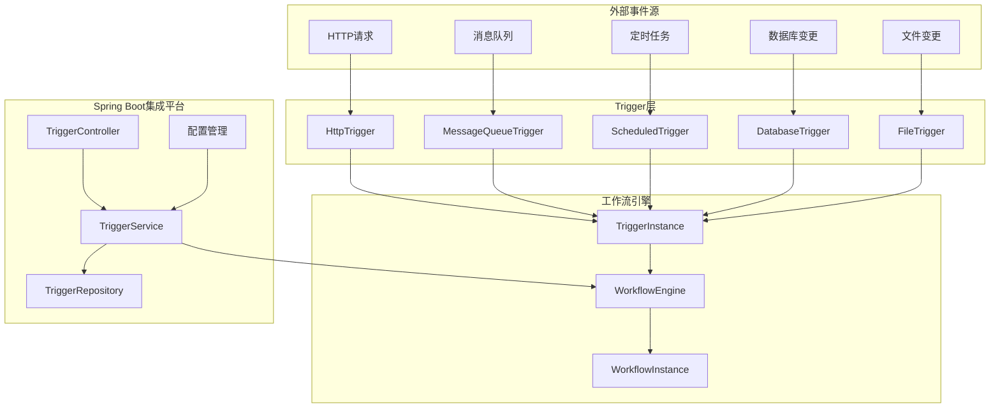
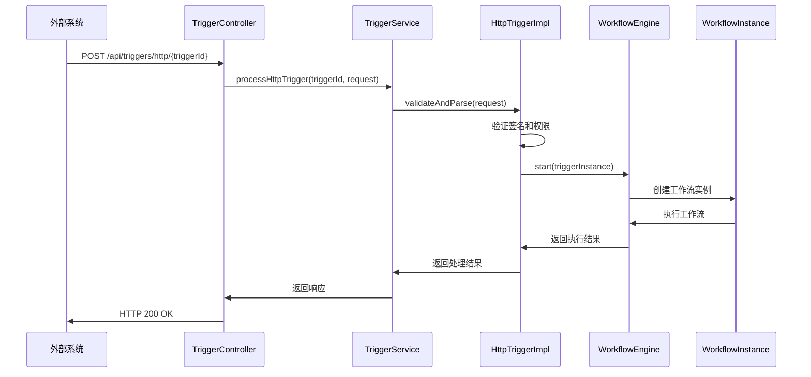
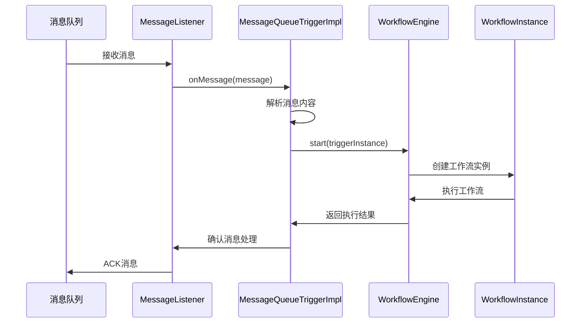

# 集成平台新增Trigger技术方案设计文档

## 1. 子模块功能描述

### 1.1 概述
基于effektif工作流框架，设计并实现集成平台的触发器(Trigger)子系统，支持多种外部事件源触发工作流执行，实现企业级集成平台的核心功能。

### 1.2 功能模块

#### 1.2.1 HttpTrigger - HTTP触发器
- **功能**: 通过HTTP Webhook接收外部系统的事件通知
- **特性**: 
  - 支持GET/POST/PUT/DELETE等HTTP方法
  - 支持JSON/XML/Form等数据格式
  - 支持请求头验证和签名验证
  - 支持异步处理和响应
- **应用场景**: 第三方系统集成、API Gateway事件、支付回调等

#### 1.2.2 MessageQueueTrigger - 消息队列触发器
- **功能**: 监听消息队列(RabbitMQ/Kafka/ActiveMQ)中的消息
- **特性**:
  - 支持多种消息中间件
  - 支持消息确认机制
  - 支持死信队列处理
  - 支持批量消息处理
- **应用场景**: 异步消息处理、事件驱动架构、微服务间通信

#### 1.2.3 ScheduledTrigger - 定时触发器
- **功能**: 基于时间规则定时触发工作流
- **特性**:
  - 支持Cron表达式
  - 支持固定间隔和固定延迟
  - 支持时区处理
  - 支持任务持久化和集群部署
- **应用场景**: 定时数据同步、报表生成、系统维护任务

#### 1.2.4 DatabaseTrigger - 数据库触发器
- **功能**: 监听数据库表的增删改操作
- **特性**:
  - 支持MySQL/PostgreSQL/Oracle等主流数据库
  - 支持CDC(Change Data Capture)技术
  - 支持表级和行级过滤
  - 支持事务一致性
- **应用场景**: 数据同步、审计日志、实时数据处理

#### 1.2.5 FileTrigger - 文件触发器
- **功能**: 监听文件系统的文件变更事件
- **特性**:
  - 支持文件创建、修改、删除事件
  - 支持目录递归监听
  - 支持文件过滤规则
  - 支持FTP/SFTP远程文件监听
- **应用场景**: 文件处理、数据导入、日志分析

## 2. 时序图和架构图

### 2.1 整体架构图



### 2.2 HTTP触发器时序图



### 2.3 消息队列触发器时序图



## 3. 关键数据结构和方法描述

### 3.1 核心类图


### 3.2 数据库表结构设计

#### 3.2.1 trigger_config表 - 触发器配置表
```sql
CREATE TABLE trigger_config (
    id BIGINT PRIMARY KEY AUTO_INCREMENT,
    trigger_id VARCHAR(64) NOT NULL UNIQUE COMMENT '触发器ID',
    trigger_type VARCHAR(32) NOT NULL COMMENT '触发器类型',
    workflow_id VARCHAR(64) NOT NULL COMMENT '关联的工作流ID',
    name VARCHAR(128) NOT NULL COMMENT '触发器名称',
    description TEXT COMMENT '描述',
    config_json TEXT NOT NULL COMMENT '触发器配置JSON',
    status TINYINT DEFAULT 1 COMMENT '状态：0-禁用，1-启用',
    created_time TIMESTAMP DEFAULT CURRENT_TIMESTAMP,
    updated_time TIMESTAMP DEFAULT CURRENT_TIMESTAMP ON UPDATE CURRENT_TIMESTAMP,
    created_by VARCHAR(64) COMMENT '创建人',
    updated_by VARCHAR(64) COMMENT '更新人',
    INDEX idx_trigger_type (trigger_type),
    INDEX idx_workflow_id (workflow_id),
    INDEX idx_status (status)
);
```

#### 3.2.2 trigger_execution_log表 - 触发器执行日志表
```sql
CREATE TABLE trigger_execution_log (
    id BIGINT PRIMARY KEY AUTO_INCREMENT,
    trigger_id VARCHAR(64) NOT NULL COMMENT '触发器ID',
    workflow_instance_id VARCHAR(64) COMMENT '工作流实例ID',
    execution_id VARCHAR(64) NOT NULL COMMENT '执行ID',
    trigger_data TEXT COMMENT '触发数据',
    execution_status TINYINT NOT NULL COMMENT '执行状态：0-失败，1-成功，2-处理中',
    error_message TEXT COMMENT '错误信息',
    execution_time TIMESTAMP DEFAULT CURRENT_TIMESTAMP COMMENT '执行时间',
    duration_ms BIGINT COMMENT '执行耗时(毫秒)',
    INDEX idx_trigger_id (trigger_id),
    INDEX idx_workflow_instance_id (workflow_instance_id),
    INDEX idx_execution_status (execution_status),
    INDEX idx_execution_time (execution_time)
);
```
