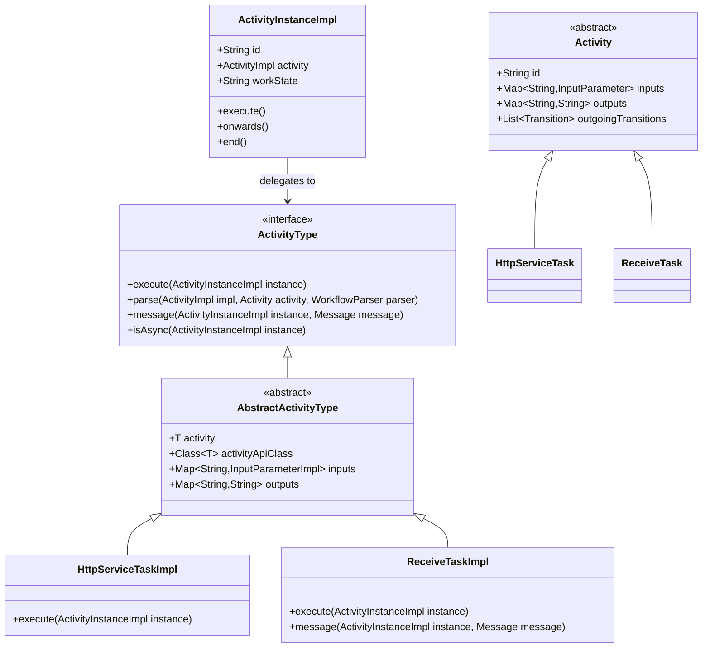
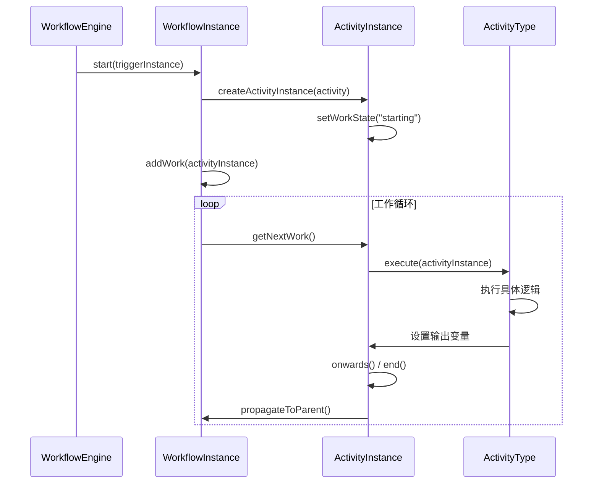
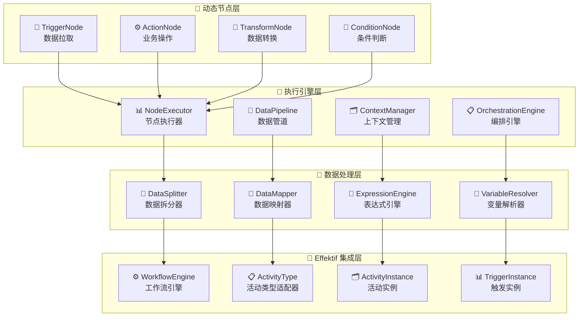

# Effektif Activity 深度分析与动态节点设计方案

## 1. Effektif Activity 核心概念理解

### 1.1 Activity 的设计模式

Effektif 采用了**定义与实例分离**的经典设计模式：

```
Activity (定义) ←→ ActivityInstance (实例)
    ↓                    ↓
静态配置模板          运行时执行对象
```

**核心特点：**
- **Activity**: 静态配置，包含活动的类型、输入输出参数、转换条件等
- **ActivityInstance**: 运行时实例，每次工作流执行到某个活动时创建
- **ActivityType**: 策略模式，定义不同类型活动的执行逻辑

### 1.2 Activity 类型系统架构



### 1.3 执行流程机制



## 2. 类似 n8n/Zapier 的动态节点设计

### 2.1 设计理念对比

| 特性 | Zapier | n8n | 我们的设计 |
|------|--------|-----|-----------|
| **数据处理** | 自动拆分数组 | 手动配置拆分 | 智能拆分 + 手动配置 |
| **节点类型** | Trigger + Action | 多种节点类型 | 统一节点接口 + 类型扩展 |
| **表达式引擎** | 简单变量引用 | JavaScript 表达式 | JavaScript + JSON Path |
| **错误处理** | 基础重试 | 完善错误处理 | 多层次错误处理 |
| **执行策略** | 数据驱动 | 节点驱动 | 混合策略 |

### 2.2 核心架构设计



### 2.3 数据处理策略

#### 策略1：顺序执行模式
```
Trigger → Action1 → Action2 → Action3
```
- **优点**: 简单直观，易于理解
- **缺点**: 批量数据处理复杂，错误处理困难

#### 策略2：数据驱动模式（推荐）
```
Trigger → DataSplitter → [WorkflowInstance1, WorkflowInstance2, WorkflowInstance3]
                              ↓              ↓              ↓
                           Action1        Action1        Action1
                              ↓              ↓              ↓
                           Action2        Action2        Action2
```
- **优点**: 独立处理每条数据，错误隔离，支持并行
- **缺点**: 复杂度稍高，需要更多资源

### 2.4 关键技术实现

#### 数据拆分器
```java
public class DataSplitter {
    public enum SplitStrategy {
        AUTO_DETECT,    // 自动检测数组
        FORCE_ARRAY,    // 强制数组拆分
        SINGLE_ITEM,    // 单项处理
        CUSTOM_PATH     // 自定义路径拆分
    }
    
    public List<DataItem> splitData(Object data, SplitStrategy strategy, String customPath) {
        // 根据策略拆分数据
        // 支持 JSON 数组、List、Map 等多种格式
    }
}
```

#### 表达式引擎
```java
public class ExpressionEngine {
    // 支持多种表达式格式：
    // {{variable}} - 简单变量引用
    // {{= expression}} - JavaScript 表达式  
    // {{$json.path}} - JSON 路径表达式
    
    public String evaluate(String expression, ActionContext context) {
        // 解析和执行表达式
    }
}
```

#### 执行编排器
```java
public class ExecutionOrchestrator {
    public enum OrchestrationStrategy {
        SEQUENTIAL,     // 顺序执行
        PARALLEL,       // 并行执行
        DATA_DRIVEN,    // 数据驱动（推荐）
        CONDITIONAL     // 条件执行
    }
    
    public CompletableFuture<OrchestrationResult> orchestrate(
        WorkflowDefinition workflow, 
        TriggerData triggerData,
        OrchestrationStrategy strategy) {
        // 根据策略编排执行
    }
}
```

## 3. 与 Effektif 的集成方案

### 3.1 适配器模式集成

```java
/**
 * 动态活动类型适配器
 * 将动态节点适配到 Effektif 的 ActivityType 接口
 */
public class DynamicActivityType implements ActivityType<DynamicActivity> {
    
    private final DynamicNode dynamicNode;
    private final NodeConfig nodeConfig;
    
    @Override
    public void execute(ActivityInstanceImpl activityInstance) {
        // 1. 创建节点上下文
        NodeContext context = createNodeContext(activityInstance);
        
        // 2. 执行动态节点
        CompletableFuture<NodeResult> future = dynamicNode.execute(context);
        
        // 3. 处理执行结果
        handleExecutionResult(activityInstance, future);
    }
}
```

### 3.2 触发器集成

```java
/**
 * 动态触发器实现
 * 继承 Effektif 的 AbstractTriggerImpl
 */
public class DynamicTriggerImpl extends AbstractTriggerImpl<DynamicTrigger> {
    
    @Override
    public void published(WorkflowImpl workflow) {
        // 启动动态触发器
        TriggerNode triggerNode = createTriggerNode();
        triggerNode.startTrigger();
    }
    
    @Override
    public void applyTriggerData(WorkflowInstanceImpl workflowInstance, TriggerInstance triggerInstance) {
        // 应用触发数据到工作流实例
        Object data = triggerInstance.getData();
        
        // 数据拆分和处理
        List<DataItem> dataItems = dataSplitter.splitData(data);
        
        // 为每个数据项创建工作流实例
        for (DataItem dataItem : dataItems) {
            createWorkflowInstance(dataItem);
        }
    }
}
```

## 4. 实施建议

### 4.1 分阶段实施计划

**第一阶段：基础框架**
- 实现 DynamicNode 接口体系
- 实现基础的 HTTP 触发器和动作节点
- 集成到 Effektif 引擎

**第二阶段：数据处理**
- 实现数据拆分器
- 实现表达式引擎
- 支持复杂数据映射

**第三阶段：高级特性**
- 实现执行编排器
- 添加错误处理和重试机制
- 性能优化和监控

**第四阶段：生态建设**
- 开发更多节点类型
- 提供可视化配置界面
- 建设插件生态

### 4.2 技术选型建议

- **开发语言**: Java 8+ (与 Effektif 保持一致)
- **框架**: Spring Boot + Spring Cloud
- **表达式引擎**: Nashorn JavaScript Engine
- **JSON 处理**: Jackson + JSONPath
- **异步处理**: CompletableFuture + ThreadPoolExecutor
- **监控**: Micrometer + Prometheus

### 4.3 性能考虑

- **并发处理**: 支持多线程并行执行
- **内存管理**: 大数据量时采用流式处理
- **缓存策略**: 缓存编译后的表达式和配置
- **资源控制**: 限制并发数和内存使用

这个设计方案结合了 Effektif 的强大工作流引擎能力和 n8n/Zapier 的易用性，既保持了系统的稳定性，又提供了灵活的动态节点扩展能力。
